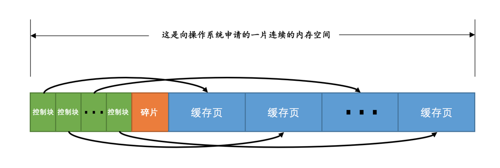
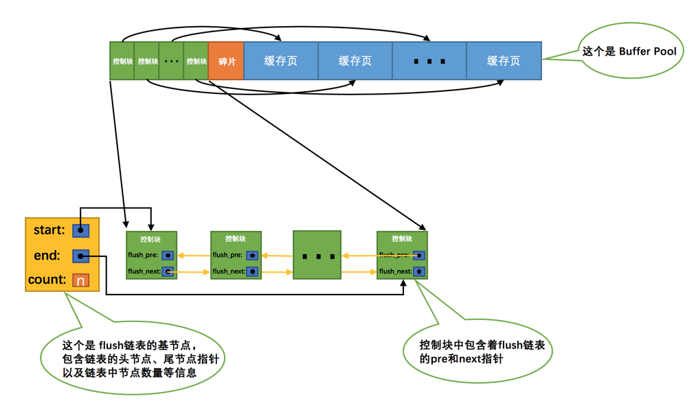
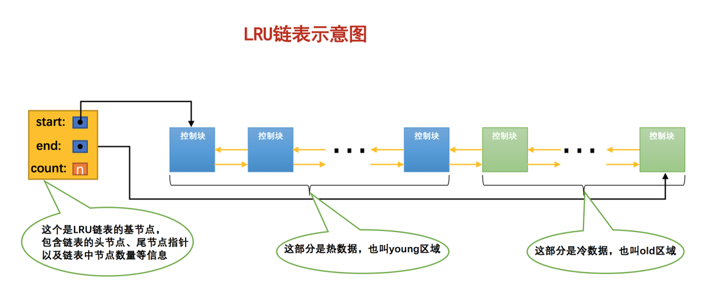
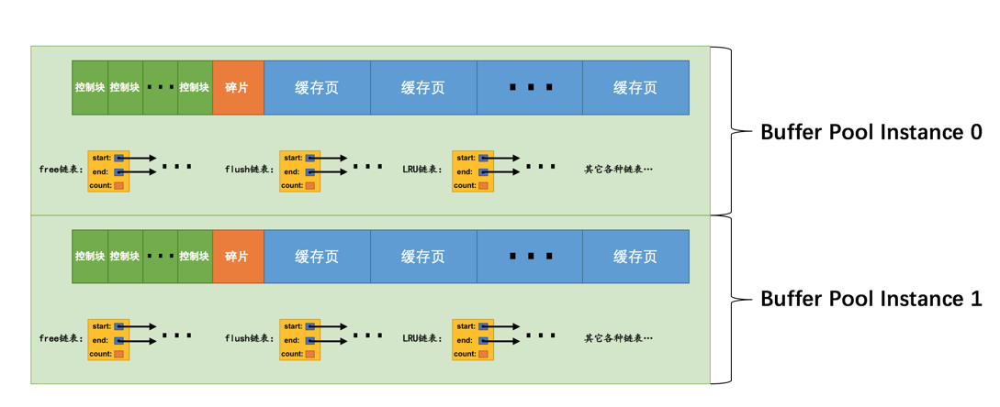
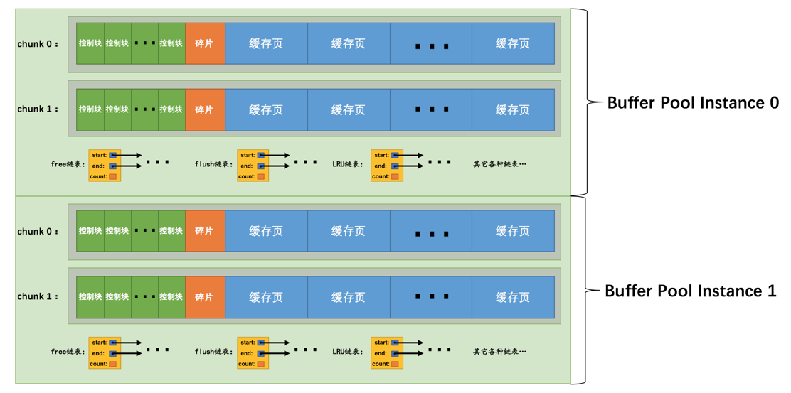

* [BufferPool因何而生：调整磁盘与 CPU 的矛盾](#bufferpool因何而生调整磁盘与-cpu-的矛盾)
* [Buffer Pool](#buffer-pool)
* [Map&lt;表空间 页码, 缓存页&gt;](#map表空间页码-缓存页)
* [三个核心链表](#三个核心链表)
  * [Free list](#free-list)
  * [Flush list](#flush-list)
  * [LRU list](#lru-list)
     * [简单的实现LRU](#简单的实现lru)
     * [进阶的实现LRU](#进阶的实现lru)
     * [超进阶的实现LRU](#超进阶的实现lru)
* [如何刷新脏页到磁盘](#如何刷新脏页到磁盘)
* [多个 BufferPool](#多个-bufferpool)
* [chunk的引入](#chunk的引入)
* [查看Buffer Pool的状态信息](#查看buffer-pool的状态信息)

# BufferPool因何而生：调整磁盘与 CPU 的矛盾

* 索引文件毕竟只是一个文件，操作它要 load 到内存中
* 即使只想 query 一条记录，也要把这条记录所在的页整个 load 近内存
* load 近内存的页读写操作后不急于释放，`缓存`起来，存这个的页的地方就是 BufferPool


# Buffer Pool
* mysql 启动的时候，从操作系统申请了一片连续的内存，默认 128M
* pool 里面放着很多页，一页 16KB，128MB 能放 8000 个缓存页
* 但实际上并不能放满 8000，因为为了管理每一个缓存页，有一个控制头，每个控制头 800 多字节就当 1KB 吧。



# Map<表空间+页码, 缓存页>
为了`迅速`判断缓存夜在不在 BufferPool 中，搞了一个 map，嘿嘿。

* map 中如果有，直接使用该缓存页就好
* 如果没有，那就从free链表中选一个空闲的缓存页，然后把磁盘中对应的页加载到该缓存页的位置。

好的，什么是 free 链表？

# 三个核心链表
## Free list

为啥需要一个 free 链表：我需要管理所有的空闲页，方便分配。

* 为了管理好这些空闲页，只要管理好对应的控制块即可
* 为了管理好这些控制块，有一个 List Base Node（innodb 的惯用套路...）。
* 然后这个 List Base Node就是这个 free list 的头（head）。
* 基本上来说这个 List Base Node 并不是放在 BufferPool 中，另有地方管理之。


## Flush list
如果我们在BufferPool中修改了某一个缓存页，那么它就脏了，需要刷回磁盘。
但是我又不能有一页就刷一次磁盘吧，innodb 惯用套路：批量。

为啥需要 flush 链表：我需要管理所有的脏页，方便批量操作。

* 为了管理好这些脏页，只要管理好对应的控制块即可
* 为了管理好这些控制块，有一个 List Base Node（继续惯用套路...）。
* 然后这个 List Base Node就是这个 flush list 的头（head）。




## LRU list

为啥需要一个 lru 链表：BufferPool 空间有限，我需要管理所有的缓存页的同时提高 cache命中率。
###  简单的实现LRU
* 如果待查询缓存页不在 BufferPool 中（不在 map 中），就 load 进来，分配一个控制块，这个控制块放到 lru 链表头
* 当BufferPool 不够用的时候，就从 lru 链表尾部删除缓存页节点（因为越靠后的缓存页越早进来越少使用）
* 如果缓存页存在，就把对应的控制块提到链表头

缺点：
* 因为 innodb 的`预读`，会提前帮你 load 一堆缓存页，这些缓存页不一定会用到，但是会占用 lru 的靠前位置，lru 稍微靠后的缓存页就被淘汰掉啦。 
* `全表扫描`，会导致 lru 一直换血，大大降低了 cache 命中率

### 进阶的实现LRU
* 先把 lru 分为两段，前半部（其实也不是一半，是5/8）叫热数据(young 区域)，后半部(3/8)叫冷数据(old 区域)
* 如何解决了`预读`问题
    * 当磁盘上的某个页面在初次加载到Buffer Pool中的某个缓存页时，该缓存页对应的控制块会被放到old区域的头部
    * 预读进来后却不进行后续访问的页面就会被逐渐从`old区域逐出`，而不会影响young区域中被使用比较频繁的缓存页
* 如何解决了`全表扫描`问题
    * 在对某个处在old区域的缓存页进行第一次访问时就在它对应的控制块中记录下来这个访问时间
    * 如果后续的访问时间与第一次访问的时间在某个时间间隔内（比如 1 秒）
        * 那么该页面就不会被从old区域移动到young区域的头部
        * 否则将它移动到young区域的头部
        
 



### 超进阶的实现LRU
我们来捋一捋 young 区域的缓存页，对于这些缓存页来说，我们每次访问一个缓存页的控制块就要把它移动到LRU链表的头部，这样开销是不是太大啦？
别忘记了，一个控制块也要 800 多字节，在内存中移来移去还是挺费性能的。
如果解决这个问题：
* 规定，如果缓存页处于 1/4 young 处，则不移动控制块到lru 的头部。
* 为啥是1/4呢，因为 innodb 作者拍脑袋决定的，认为这1/4数据是热中热，大热门，不移动也罢。


# 如何刷新脏页到磁盘
* 策略 BUF_FLUSH_LIST：有一个后台线程，`定期`刷 flush 链表到磁盘中
* 策略 BUF_FLUSH_LRU：还是那个后台线程，`定期`去 lru 的冷数据区域(后3/8)遍历缓存页是不是脏页，是的话就刷到磁盘
* 策略 BUF_FLUSH_SINGLE_PAGE：如果lru 不够用了，那个后台线程不给力刷得比较慢，我只能去 lru 的尾部看看有没有脏页直接刷到磁盘
    * 这种情况属于迫不得已，很慢，很损性能（好像和批量不沾边的都不提倡）
    
# 多个 BufferPool
是的，很明显一个 BufferPool 是不够用的。我们希望能多个。因为他们可以
* 独立的去申请内存空间
* 独立的管理各种链表（链表的加锁处理也是独立的）
* 独立的刷脏页

反正最终目的是：在多线程并发访问时并不会相互影响，从而`提高并发处理`能力。
服务器启动的时候的配置:
```dtd
[server]
innodb_buffer_pool_instances = 2
```



# chunk的引入
BufferPool 的大小调整时 `innodb_buffer_pool_instances` 从 128M 改为 6G（国哥设置过...），操作如下：
* 重新向操作系统申请一块连续的内存空间
* 然后将旧的Buffer Pool中的内容复制到这一块新空间

innodb 作者发现有一个问题，对于比较大块头的连续内存空间的复制实在是太耗时了。
能不能像是动态硬盘，不够我就加一块，再不够我就加一块？
能：`chunk`就是一块块可抽插的动态硬盘！

一个Buffer Pool实例其实是由若干个chunk组成的，一个chunk就代表一片连续的内存空间，里边儿包含了若干缓存页与其对应的控制块，画个图表示就是这样


所以以后再服务器运行期间调整 BufferPool 的值就不会大动干戈了：
* 默认一个 chunk 是 128MB
* 以chunk为单位增加或者删除内存空间，而不需要重新向操作系统申请一片大的内存，然后进行缓存页的复制
* chunk size 这个 128MB 是服务器启动的时候就要确定的配置，不能改

# 查看Buffer Pool的状态信息
```dtd
mysql> SHOW ENGINE INNODB STATUS\G

(...省略前边的许多状态)
----------------------
BUFFER POOL AND MEMORY
---------------------- 
Total memory allocated 13218349056;   # BufferPool 的向 OS 申请的总大小字节，这里是 12GB！！
Dictionary memory allocated 4014231   # 数据字典的，不 care
Buffer pool size   786432             # 代表该Buffer Pool可以容纳多少缓存页，单位是页，总大小是786432 * 16KB = 12582912KB = 12GB
Free buffers       8174               # 空闲链表中页的个数，单位是页，总大小是8174 * 16KB = 130784 KB = 127MB
Database pages     710576             # LRU管理的页的个数，总大小是 710576 * 16KB = 11369216KB = 10GB
Old database pages 262143             # LRU old 区域(后3/8)管理的页的个数, 262143 * 16KB = 4194288KB = 3GB
Modified db pages  124941             # flush 链表中个数，也就是脏页的个数，124941 * 16KB = 1999056KB = 1GB
Pending reads 0                       # 等待从磁盘载入内存（也就是 BufferPool）的页数
Pending writes: LRU 0, flush list 0, single page 0 # 即将从LRU链表中刷新到磁盘中的页面数量，即将从flush链表中刷新到磁盘中的页面数量， 即将以单个页面的形式刷新到磁盘中的页面数量
Pages made young 6195930012, not young 78247510485 # 代表LRU链表中曾经从old区域移动到young区域头部的节点数量；没办法（为啥没办法？预读和全表扫描的解决方案）去 young 区域的页的个数。
108.18 youngs/s, 226.15 non-youngs/s # 代表每秒从old区域被移动到young区域头部的节点数量； 代表每秒由于不满足时间限制而不能从old区域移动到young区域头部的节点数量。
Pages read 2748866728, created 29217873, written 4845680877 # 代表读取（所以曾经加起来读过 41944 GB 的数据？），创建，写入了多少页。
160.77 reads/s, 3.80 creates/s, 190.16 writes/s  # 读取、创建、写入的速率。
Buffer pool hit rate 956 / 1000, young-making rate 30 / 1000 not 605 / 1000 # 表示在过去某段时间，平均访问1000次页面，有多少次该页面已经被缓存到Buffer Pool了；表示在过去某段时间，平均访问1000次页面，有多少次访问使页面移动到young区域的头部了； 后面的 not 就是没挪动到 young的比率。
Pages read ahead 0.00/s, evicted without access 0.00/s, Random read ahead 0.00/s
LRU len: 710576, unzip_LRU len: 118             # 代表LRU链表中节点的数量； 代表unzip_LRU链表中节点的数量
I/O sum[134264]:cur[144], unzip sum[16]:cur[0]  # 最近50s读取磁盘页的总数； 现在正在读取的磁盘页数量； 最近50s解压的页面数量； 正在解压的页面数量
--------------
(...省略后边的许多状态)

mysql>
```

