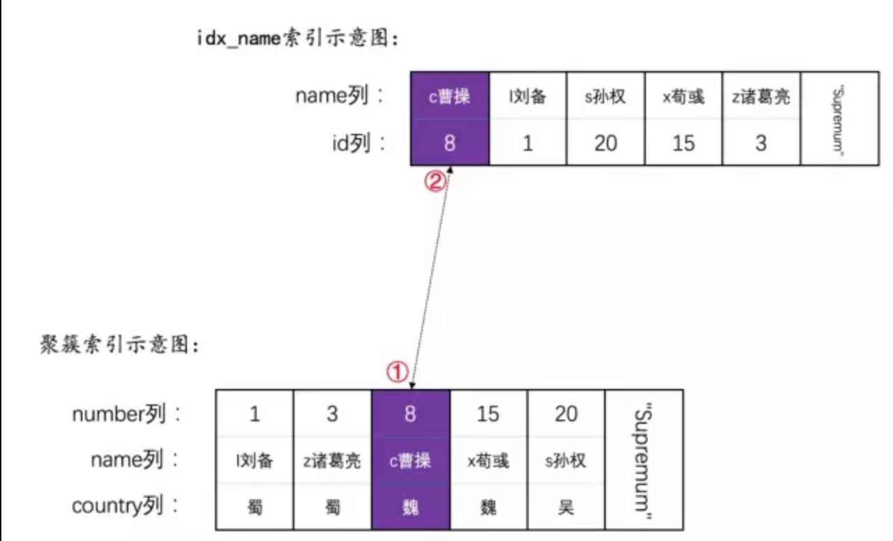
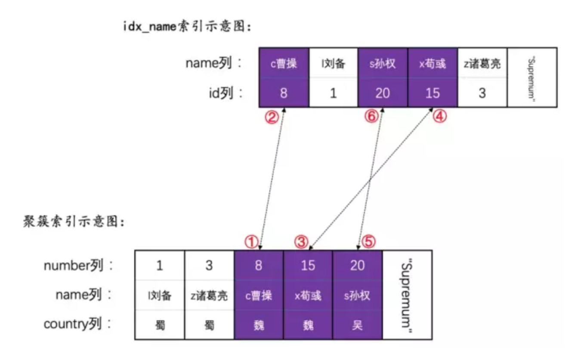
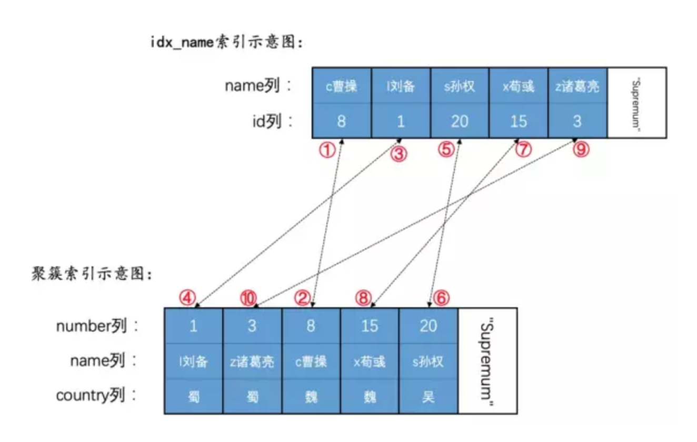
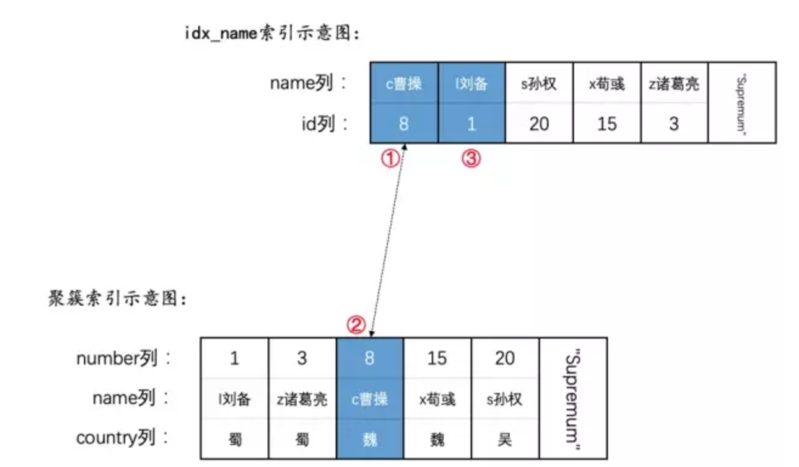

一条语句的加锁需要考虑很多方面：

* 当前事务的隔离级别
* 语句执行时候的索引是主键索引还是二级索引
* 查询条件，=，>=，<=
* 具体执行的语句类型：insert、update、delete 又各不相同

但我们可以把握住一个原则，加锁是为了解决：脏读、脏写、不可重复读、幻读这些现象！

# 锁分析 3 种类型的语句

## 普通的 Select 语句
* READ UNCOMMITTED 隔离级别下，不加锁，直接读取记录的最新版本，可能发生脏读、不可重复读和幻读问题。
* READ COMMITTED 隔离级别下，不加锁，每次 SELECT 生成一个 ReadView， 遍历版本链，找到契合当前事务的版本，可能发生不可重复读和幻读问题。
* REPEATABLE READ 隔离级别下，不加锁，只在第一次 SELECT 生成一个 ReadView，遍历版本链，找到契合当前事务的版本，啥问题都不会发生。
    
    但 RR 级别下有一个关于幻读的 base case：
    ```dtd
    # 事务T1，REPEATABLE READ隔离级别下
    mysql> BEGIN;
    Query OK, 0 rows affected (0.00 sec)
    
    mysql> SELECT * FROM hero WHERE number = 30;
    Empty set (0.01 sec)
    
    # 此时事务T2执行了：INSERT INTO hero VALUES(30, 'g关羽', '魏'); 并提交
    
    mysql> UPDATE hero SET country = '蜀' WHERE number = 30;
    Query OK, 1 row affected (0.01 sec)
    Rows matched: 1  Changed: 1  Warnings: 0
    
    mysql> SELECT * FROM hero WHERE number = 30;
    +--------+---------+---------+
    | number | name    | country |
    +--------+---------+---------+
    |     30 | g关羽   | 蜀      |
    +--------+---------+---------+
    1 row in set (0.01 sec)
    ```
    分析：
    * 从结果上来说，事务 T1 两次 select 返回的结果并不相同，所以幻读并没有解决。
    * 原因：
        * 事务 T1 因为没有任何加锁，所以其他的事务 T2 可以随心随欲插入数据+提交
        * 事务 T1 因为手贱 update 了一次，此时生成了一个事务 ID（本来是 0），但是这样一来这条新记录的trx_id隐藏列就变成了T1的事务id
        * 事务 T1 再一次 select 遍历版本链时，新纪录也有 ReadView，里面的事务 ID 符合当前事务 T1 的 ID, 所以能看到这条新插入的记录
    
    总结：因为这个特殊现象的存在，你也可以认为InnoDB中的MVCC并不能完完全全的禁止幻读
* Serializable 隔离级别下可加可不加锁
    * 当 autocommit=0 时，加锁！普通的 SELECT 语句会被转为```SELECT ... LOCK IN SHARE MODE```这样的语句，需要先获取记录的 S 锁
    * 当 autocommit=1 时，不加锁！普通的 SELECT 语句会利用 MVCC 来生成一个 ReadView 去读取记录
        * 原因：一个事务就一条 SQL，还想脏读、幻读、不可重复读？上面的问题至少要两条一样的语句吧，读 2 次！

## 锁定读语句
锁定读一共有四种语句放到一起讨论：
* 语句一：SELECT ... LOCK IN SHARE MODE;
* 语句二：SELECT ... FOR UPDATE;
* 语句三：UPDATE ...
* 语句四：DELETE ...

其中：
* 语句一和语句二是MySQL中规定的两种锁定读的语法格式
* 语句三和语句四由于在执行过程需要首先定位到被改动的记录并给记录加锁，也可以被认为是一种锁定读。

### 对于使用主键进行等值查询的情况
* 使用 LOCK IN SHARE MODE 来加 S 型锁：
    ```dtd
    SELECT * FROM hero WHERE number = 8 LOCK IN SHARE MODE;
    ```
  语句执行时只需要访问聚簇索引的 number=8 的记录，加上 S 型的正经记录锁。
* 使用 FOR UPDATE 来加 X 型锁：
    ```dtd
    SELECT * FROM hero WHERE number = 8 FOR UPDATE;
    ```
  语句执行时只需要访问聚簇索引的 number=8 的记录，加上 X 型的正经记录锁。
* 使用 UPDATE 来加 X 型锁：
    ```dtd
    UPDATE hero SET country = '汉' WHERE number = 8;
    ```
    * 没有更新二级索引列
        * ```UPDATE hero SET country = '汉' WHERE number = 8;``` 
        * 那么加锁方式和 ```SELECT ... FOR UPDATE```语句一致
    * 更新了二级索引列
        * ```UPDATE hero SET name = '曹操' WHERE number = 8;```
        * 加锁步骤是先加主键索引的锁，再加二级索引的锁：
            * 为 number 值为 8 的聚簇索引记录加上X型正经记录锁（该记录对应的）
            * 为 number 值为 8，name 为曹操 的二级索引记录加上 X 型正经记录锁。
        
* 使用 DELETE 来加 X 型锁：    
    * 这个和 UPDATE 语句的加锁分析一致
    * 不修改二级索引的值：
        * 那么就加锁方式和 SELECT ... FOR UPDATE 一致
    * 修改了二级索引的值：
        * 先为聚簇索引记录加锁
        * 再为对应的二级索引记录加锁  

### 用主键索引进行范围查询的情况

回顾下我们的的数据：
```dtd
CREATE TABLE hero (
    number INT,
    name VARCHAR(100),
    country varchar(100),
    PRIMARY KEY (number),
    KEY idx_name (name)
) Engine=InnoDB CHARSET=utf8;

INSERT INTO hero VALUES
    (1, 'l刘备', '蜀'),
    (3, 'z诸葛亮', '蜀'),
    (8, 'c曹操', '魏'),
    (15, 'x荀彧', '魏'),
    (20, 's孙权', '吴');
``` 

* 使用了 SELECT ... LOCK IN SHARD MODE 为记录加锁如：``` select * from hero where number<=8 lock in share mode```   
    * 执行步骤：
        * 1、先去聚簇索引定位到第一条 number<=8 的记录，也就是 number=1 的记录，为其加 S 型行锁
        * 2、判断是否符合条件下推
            * 条件下推：Index Condition Pushdown，ICP，目标是减少回表次数进而减少 IO 操作。
            * 查询中与被使用索引有关的查询条件下推到存储引擎中判断，而不是返回到server层再判断。
            * 对于聚簇索引而言，它本身就包含了所有的列信息，无需回表，起不到减少 IO 操作的作用，所以下推只适合二级索引。
            * 本次 number<=8 是聚簇索引，不符合条件，放弃下推。
        * 3、判断是否符合 number<= 8 这个范围查询条件    
            * 对于主键范围查询的情况，innodb 作者规定每次从聚簇索引取回一条记录，都要判断下是否符合边界条件 
                * 如果符合，返回到 server 层继续处理
                * 如果不符合，释放记录上的锁结构，并给server层返回一个查询完毕的信息
        * 4、将该记录返回到server层继续判断
            * server 层如果收到存储引擎层提供的查询完毕的信息，就结束查询
            * server 层如果没有收到查询完毕的信息，继续判断那些没有进行索引条件下推的条件 
                * 刚不是在第三步的引擎层已经做过了吗？
                * 好像是简单粗暴：把凡是没有经过索引条件下推的条件都需要放到server层再判断一遍。
                    * 如果该记录符合剩余的条件（没有进行索引条件下推的条件），那么就把它发送给客户端
                    * 不然的话需要释放掉在该记录上加的锁。
        * 5、然后刚刚查询得到的这条记录（也就是number值为1的记录）组成的单向链表继续向后查找，得到了number值为3的记录，然后重复第2，3，4、5这几个步骤。
            * 注意：因为遍历到 number=8的记录时并不知道后面的那条记录是不是符合范围查找条件，所以要再往后插一条。
            * 步骤：
                * 先为 number=15 的记录加上 S 型正经记录锁
                * 发现不符合范围条件后，再释放 number=15 的记录上面的 S 型正经记录锁
            * 问题：如果有2 个事务 T1和T2，其中 T1范围查找 number<=8 for update, 在 T2 上 select number=15 for update，有趣的事情发生了。
                * 如果 T1 先执行，T2 后执行
                    * 因为 T1 会先S锁一下number=15 的记录后释放，T2 再去为 number=15 的记录加上 X 型记录锁，一切正常！
                * 如果 T2 先执行，T1 再执行
                    * 因为 T2 已经为 number=15 的记录加上了 X 型记录锁，此时 T1 想"先加锁再释放"就没办法了，只能等待 T2 事务提交。
                * todo1：测试发现在 RR 级别下，无论 t1 还是 t2 都是互相阻塞的！    
                * todo2：测试发现在 Read Committed 级别下，先 t1再 t2 符合上述情况！ 先 t2 再 t1 也符合上述情况！   

* 使用了 SELECT ... FOR UPDATE 为记录加锁如：``` select * from hero where number<=8 for update```   
    * 执行步骤：和 LOCK IN SHARE MODE 相似，只是加的锁变成 X 锁 
* 使用UPDATE ...来为记录加锁
    * 没有更新二级索引：
        * 比方说 ```UPDATE hero SET country = '汉' WHERE number >= 8;```
        * 执行步骤：和 SELECT ... FOR UPDATE 相同
    * 更新了二级索引：
        * 比方说 ```UPDATE hero SET name = 'cao曹操' WHERE number >= 8;```
        * 执行步骤：
            * 1、为 number=8 的聚簇索引记录加上 X 型正经记录锁
            * 2、为 number=8 的聚簇索引对应的二级索引记录加上 X 型正经记录锁
            * 3、为 number=15 的聚簇索引记录加上 X 型正经记录锁
            * 4、为 number=15 的聚簇索引对应的二级索引记录加上 X 型正经记录锁
            * 5、为 number=20 的聚簇索引记录加上 X 型正经记录锁
            * 6、为 number=20 的聚簇索引对应的二级索引记录加上 X 型正经记录锁
            
* 使用DELETE ...来为记录加锁
    * 与用UPDATE ...来为记录加锁   
    
### 用二级索引进行定值查询的情况
     
回顾下我们的的数据：
```dtd
CREATE TABLE hero (
    number INT,
    name VARCHAR(100),
    country varchar(100),
    PRIMARY KEY (number),
    KEY idx_name (name)
) Engine=InnoDB CHARSET=utf8;

INSERT INTO hero VALUES
    (1, 'l刘备', '蜀'),
    (3, 'z诸葛亮', '蜀'),
    (8, 'c曹操', '魏'),
    (15, 'x荀彧', '魏'),
    (20, 's孙权', '吴');
```
           
* 使用了 SELECT ... LOCK IN SHARD MODE 为记录加锁如：``` select * from hero where name='caocao' lock in share mode```   
    * 执行步骤：
        * 1、所以先要对二级索引记录加 S 型正经记录锁
        * 2、再回表给对应的聚簇索引记录加 S 型正经记录锁
    * 因为顺序和聚簇索引加锁的相反，可能出现死锁：
        * 事务 T1 `SELECT * FROM hero WHERE name = 'c曹操' LOCK IN SHARE MODE;`
        * 事务 T2 `UPDATE hero SET name = '曹操' WHERE number = 8;`
        * 事务 T1 持有二级索引记录的锁，等待聚簇索引记录上的锁
        * 事务 T2 持有聚簇索引记录上的锁，等待二级索引记录上的锁
        * 循环等待，死锁。

* 使用了 SELECT ... FOR UPDATE 为记录加锁如：``` select * from hero where name='caocao' for update```   
    * 与 SELECT ... LOCK IN SHARD MODE 为记录加锁相似，只不过加的是 X 型正经记录锁
    
* 使用了 UPDATE ... 为记录加锁：
    * 与更新二级索引记录的 SELECT ... FOR UPDATE 类似，只不过被更新的列中如果还有其他二级索引列，对应的二级索引记录也要被加锁
    
* 使用了 DELETE ...为记录加锁：
    * 与更新二级索引记录的 SELECT ... FOR UPDATE 类似，只不过被删除的列中如果还有其他二级索引列，对应的二级索引记录也要被加锁
        
### 用二级索引进行范围查询
* select ... lock in share mode 
    * 示例：```SELECT * FROM hero FORCE INDEX(idx_name)  WHERE name >= 'c曹操' LOCK IN SHARE MODE;```
    * 步骤：找到第一条满足条件的二级索引记录，然后先 S 锁二级索引记录，再回表 S 锁聚簇索引记录
    
    * 特殊的场景：```SELECT * FROM hero FORCE INDEX(idx_name)  WHERE name <= 'c曹操' LOCK IN SHARE MODE;```
        * 先加锁一条二级索引记录，然后加锁聚簇索引记录，因为有个条件下推的存在，此时并不返回 server 层，直接考察下一条二级索引记录
        * 如果这条二级索引记录不符合索引条件下推的条件，直接返回 server 层
        * 此时此刻是忘记解锁这条可怜的二级索引记录...
        

* select ... for update
    * 与 select ... lock in share mode 类似，只是加的锁是 X 型正经记录锁
* update ...
    * 示例： ``` UPDATE hero SET country = '汉' WHERE name >= 'c曹操'; ```    
    * 步骤：与 select ... for update 类似
    * 步骤：
        * 1、我们前边说的索引条件下推这个特性只适用于SELECT语句，也就是说UPDATE语句中无法使用
        * 2、那么这个语句就会为name值为'c曹操'和'l刘备'的二级索引记录以及它们对应的聚簇索引进行加锁
        * 3、之后在判断边界条件时发现name值为'l刘备'的二级索引记录不符合name <= 'c曹操'条件
        * 4、再把该二级索引记录和对应的聚簇索引记录上的锁释放掉
* delete ...
    * 与 update 类似        

## 全表扫描
* select ... lock in share mode
    ```dtd
    SELECT * FROM hero WHERE country  = '魏' LOCK IN SHARE MODE;
    ```
    因为这个 country 没有索引，所有只能全表扫描：
    * 1、存储引擎每读取一条聚簇索引记录
    * 2、给读取的聚簇索引记录加 S 型正经记录锁
    * 3、返回 server 层，判断 country 是不是等于魏国
        * 若是则返回客户端
        * 若不是则释放该锁
* select ... for update
    ```dtd
    SELECT * FROM hero WHERE country  = '魏' for update;
    ```
    与 select ... lock in share mode 类似，不过加的是 X 型正经记录锁
* UPDATE ...
    * 遍历聚簇索引记录时，会逐一为记录加上 X 型正经记录锁
    * 如果聚簇索引记录不满足条件，则释放锁
    * 如果满足的则会对相应的**改动到的**二级索引记录加上 X 型正经记录锁
* 和DELETE ...
    * 遍历聚簇索引记录时，会逐一为记录加上 X 型正经记录锁
    * 如果聚簇索引记录不满足条件，则释放锁
    * 如果满足的则会对**所有的**二级索引记录加上 X 型正经记录锁