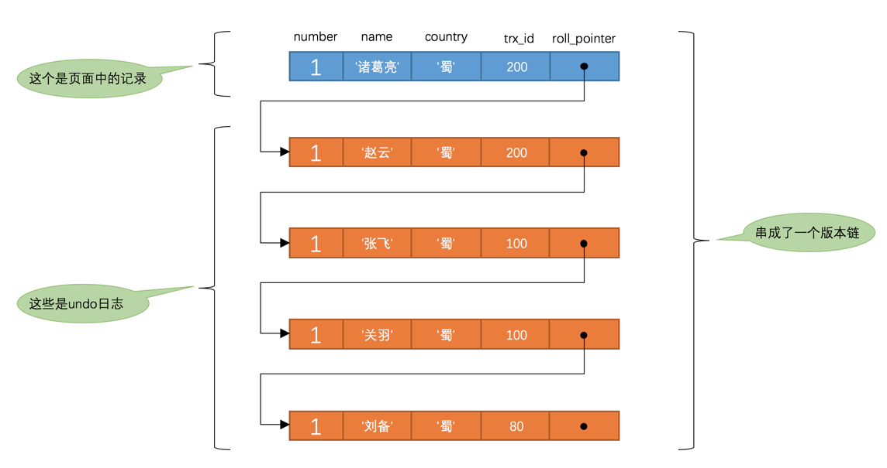

# 事务的隔离级别
写在前面的感悟：
* 理论上来说事务的ACID特性中，我们都是渴望绝对隔离的
* 但实际上来说，性能不允许，只能设置不同的隔离级别，去适配不同的性能要求

## 说隔离级别之前先说遇到的问题（因为级别是为了解决这些问题而划分的）：
* 脏写
    * 假设hero的名字为孙权
    * session1开启事务1，该事务更新hero的名字为：刘备
    * session2开启事务2，该事务更新hero的名字为：曹操
    * session1提交事务1
    * session2回滚事务2
    * 结果最终的hero名字还是孙权，session1就很懵逼，我更新了数据，也提交事务，最终啥都没做？
* 脏读
    * 假设hero的名字为孙权
    * session1开启事务1
    * session2开启事务2，该事务2更新hero的名字为：曹操
    * session1的事务1查询hero，发现竟然是曹操
    * session2回滚事务2，数据应该回滚为：孙权
    * 但可惜session1的事务拿到的数据一直是曹操(它读到了一个不存在的数据)，这就难搞了
* 不可重复读
    * 假设hero的名字为孙权
    * session1开启事务1，读到了孙权
    * session2开启事务2，该事务2更新hero名字为：曹操，并提交事务2！
    * session1的事务1再读一次hero，发现读到了曹操
    * 这session1在同一个事务1中前后两次读到2个英雄，懵逼了。
* 幻读
    * 假设hero表为空，没有一条数据
    * session1开启事务1，select * from hero where id>0，读不到任何记录（这很好）
    * session2开启事务2，insert一条hero记录（曹操）并提交
    * session1的事务1继续之前的 select * from hero where id>0，竟然读到了曹操
    * session1仿佛产生幻觉，所以叫幻读...
        * 幻读强调的是一个事务按照某个相同条件多次读取记录时，后读取时读到了之前没有读到的记录
        * 那对于先前已经读到的记录，之后又读取不到这种情况，算啥呢？(算不可重复读)
        
## 好了，为了解决上述的问题，SQL定义了4个隔离级别: 
首先，隔离级别是牺牲一点隔离性来成全性能，但是至少要保证基本的隔离性、正确性，所以脏写是不允许存在的。
* 读未提交
    * 顾名思义，可以读到别的事务未提交的数据
    * 会出现：脏读、不可重复读、幻读
* 读已提交
    * 可以读到别的事务已经提交的数据
    * 会出现：不可重复读、幻读
* 可重复读
    * 保证一个事务内，相同条件读到的数据一致
    * 会出现：幻读
* 可串行化
    * 绝对隔离
    * 啥都不会出现

## MYSQL擅自修改了4个隔离级别

** 有一点点不同：mysql的可重复读，能保证无法出现幻读！！！**

* 读未提交
    * 顾名思义，可以读到别的事务未提交的数据
    * 会出现：脏读、不可重复读、幻读
* 读已提交
    * 可以读到别的事务已经提交的数据
    * 会出现：不可重复读、幻读
* 可重复读
    * 保证一个事务内，相同条件读到的数据一致
    * **啥都不会出现**
* 可串行化
    * 绝对隔离
    * 啥都不会出现

# MVCC原理

MVCC（Multi-Version Concurrency Control ，多版本并发控制）
指的就是在使用READ COMMITTD、REPEATABLE READ这两种隔离级别的事务在执行普通的SELECT操作时访问记录的版本链的过程，这样子可以使不同事务的读-写、写-读操作并发执行，从而提升系统性能。
* 关键词1：只在READ COMMITTD、REPEATABLE READ两种隔离级别
* 关键词2：执行普通的SELECT操作
* 关键词3：允许读写-写读的并发执行，提高系统性能

## 版本链
* 每一个记录的3个隐藏字段： row_id（非必要） + trx_id + roll_pointer
* 其中的roll_pointer能把这条记录的所有undo日志串联起来
* MVCC的底层原理就是版本链 + ReadView

我们先看版本链：

这里友情提示下：版本链的意思是，roll_pointer把这条纪录的所有undo日志给串起来
* 关键词1：这条记录，也就是说，这条记录**首先得存在**
* 关键词2：还是这条记录，也就是说，MVCC解决的是多事务之间的update冲突（**insert冲突有记录锁去解决**）

想到这里，发现insert类型的undo日志还真的应该和update类型的区别对待，理由：
* insert 的undo日志，在提交后就没用了，因为我要么插入，要么回滚不插入，我不会同时遇到insert和update。
* 这么说吧，如果update的时候那条记录不存在，我想组成版本链都做不到！
* 所以接下来我们说得版本链，其实是多个事务的update操作。

## ReadView
先看两个和MVCC无关的隔离级别：
* READ UNCOMMITTED隔离级别： 直接读版本链的最新记录就好了
* SERIALIZABLE隔离级别： 这些事务和MVCC无关，全靠锁解决

再看两个和MVCC有关的隔离级别：
* READ COMMITTED: 都必须保证读到已经提交了的事务修改过的记录 + 我选择读别的事务提交的！
* REPEATABLE READ:  都必须保证读到已经提交了的事务修改过的记录 + 但我选择不读别的事务提交的！

