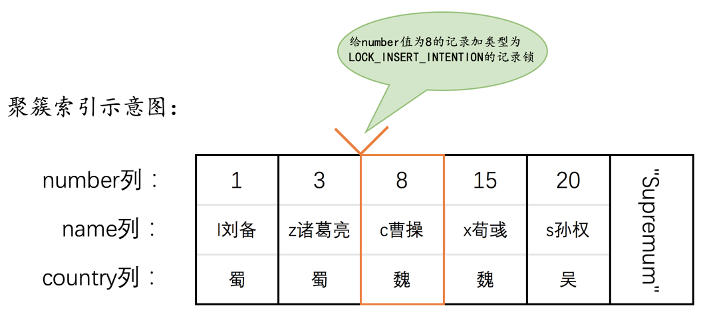
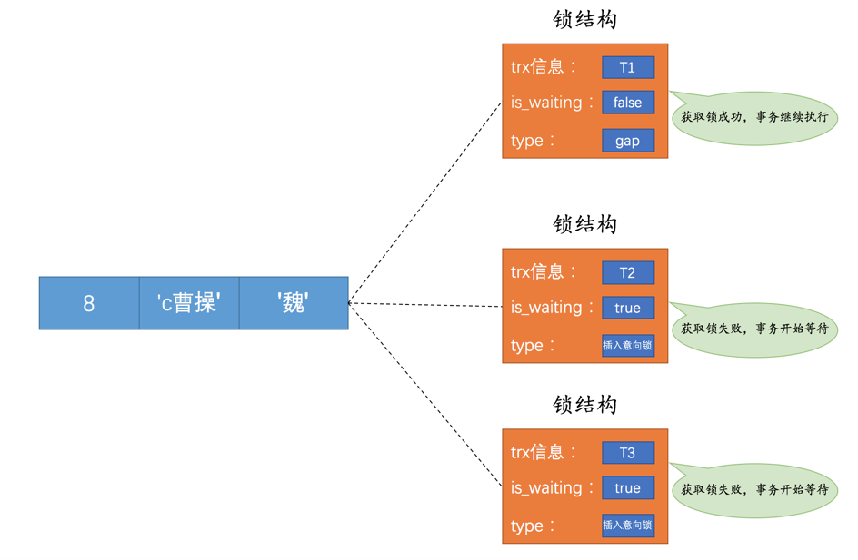
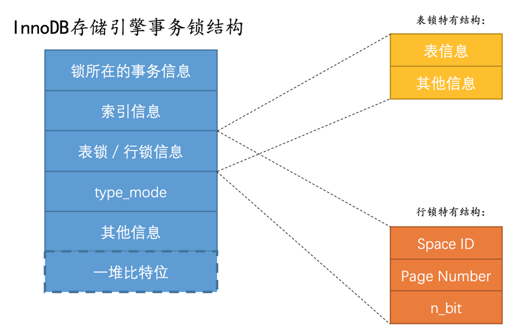
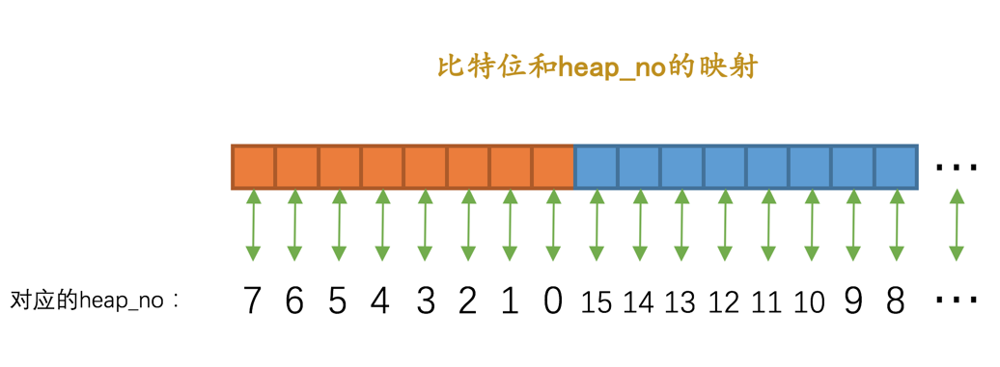

* [并发事务访问相同数据分为 3 种情况](#并发事务访问相同数据分为-3-种情况)
* [一致性读](#一致性读)
* [锁定读](#锁定读)
  * [锁定读的目标](#锁定读的目标)
  * [锁的分类](#锁的分类)
  * [锁定读的语句](#锁定读的语句)
* [写操作](#写操作)
  * [delete](#delete)
  * [insert](#insert)
  * [update](#update)
* [多粒度锁](#多粒度锁)
* [意向锁](#意向锁)
* [mysql 的锁](#mysql-的锁)
  * [我们看看 innodb 的表级锁情况：](#我们看看-innodb-的表级锁情况)
  * [我们看看 innodb 的行级锁情况](#我们看看-innodb-的行级锁情况)
* [InnoDB锁的内存结构](#innodb锁的内存结构)
  * [一个锁结构打一批数据](#一个锁结构打一批数据)
  * [锁结构的真正面目](#锁结构的真正面目)
  * [锁结构的demo1：事务t1想对一条number=15的记录加S锁](#锁结构的demo1事务t1想对一条number15的记录加s锁)
  * [锁结构的demo2：事务t2想对number=3，8，15的3条记录加X型的next-key锁](#锁结构的demo2事务t2想对number3815的3条记录加x型的next-key锁)
  
# 并发事务访问相同数据分为 3 种情况
* 读读: 并发事务相继读取相同的记录
    * 毫无影响，多少人来读都行
* 写写: 并发事务相继对相同的记录做出改动
    * 所有未提交的事务写相同的记录都必须排队执行，否则脏写
    * 实际上事务刚开始的时候并没有锁
    * 当一个事务想对这条记录做改动时，首先会看看**内存**（哪个位置？）中有没有与这条记录关联的锁结构
    * 当没有的时候就会在内存中生成一个**锁结构**与之关联
        * 锁结构: 
            * trx信息: 哪个事务生成的锁
            * is_waiting: 是否等待 
    * 假设事务 T1 想改一条数据首次生成的锁结构
        * trx信息: T1
        * is_waiting: false
        * 这表示 T1 加锁成功
    * 假设事务 T2 也想改这条数据，发现有一个锁与之关联，所以事务 T2 也生成一个锁结构
        * trx 信息: T2
        * is_waiting: true
        * 这表示 T2 加锁失败
    * T1 提交后:
        * 锁释放
        * 看看这条记录还有哪个事务在等待锁, 将其锁结构的 is_waiting=false
        * 唤醒该事务对应的线程, 使其继续执行
* 读写/写读: 一个事务读,一个事务写
    * 可能会导致脏读、不可重复读、幻读
    * 怎么解决上述问题: 
        * 读操作利用多版本并发控制（MVCC），写操作进行加锁
        * 读操作加锁，写操作加锁
            * 连读操作都加锁，事务 T1 读这条数据，别的事务想修改这条数据必须等事务 T1 提交！
# 一致性读
事务利用MVCC进行的读取操作称之为一致性读。它有很多别名: 
* 快照读
* 一致性无锁读

所有普通的SELECT语句（plain SELECT）在READ COMMITTED、REPEATABLE READ隔离级别下都算是一致性读，比方说: 
```dtd
SELECT * FROM t;
SELECT * FROM t1 INNER JOIN t2 ON t1.col1 = t2.col2
```
一致性读并不会对表中的任何记录做加锁操作，其他事务可以自由的对表中的记录做改动。


# 锁定读

## 锁定读的目标
* 并发事务在读读不会有问题
* 在读写/写读和写写的时候，需要通过 MVCC 或加锁来解决。

在加锁的情况下，为了实现：
    * 读读互不干扰
    * 读写相互阻塞
    * 写写相互阻塞

## 锁的分类
需要对锁进行分类：
* 共享锁，Shared Locks，S 锁
* 排它锁，Exclusive Locks, X 锁

目标是：
* 假设事务 T1 拿到了 S 锁，那么事务 T2 也想访问这条数据：
    * 如果事务 T2 想要再获取一个记录的 S 锁，那么事务 T2 也会获得 S 锁，意味着事务 T1 和 T2 同时持有 S 锁
    * 如果事务 T2 想要再获取一个记录的 X 锁，那么事务 T2 将会阻塞，直到事务 T1 提交后把 S 锁释放
* 假设事务 T1 拿到了 X 锁，那么事务 T2 也想访问这条数据：
    * 如果事务 T2 想要获取该记录的 S 锁，is_waiting=true, 需要直到事务 T1 提交后把 X 锁释放
    * 如果事务 T2 想要获取该记录的 X 锁，is_waiting=true, 需要直到事务 T1 提交后把 X 锁释放

简单来说就是：

|兼容性|	X	|S|
|:----|---|---|
|X|	不兼容|	不兼容|
|S|	不兼容|	兼容|


## 锁定读的语句
之前提到了，普通的 select 语句都是用 MVCC进行的读取操作。
那么什么情况的 select 语句可以用锁呢？

* 给读取的记录加 S 锁
```dtd
SELECT ... LOCK IN SHARE MODE;
```
* 给读取的记录加 X 锁
```dtd
SELECT **** FOR UPDATE
```

# 写操作

## delete
删除一条记录的流程：
* 从 B+树定位到这条记录的位置
* 获取这条记录的 X 锁
* 执行 delete mark 操作
* purge 后台线程会执行真正的 delete 操作
    * 把记录的 next_record 指向改变，删除记录链表假如该记录
    * 索引页的 page header 的槽信息、记录数量、删除记录字节等信息调整

我们看 delete 操作的第一步骤：定位待删除记录在B+树中位置的过程！ 看成一个获取 X 锁的锁定读。
ps：毕竟你要操作这条数据，首先要先读到这条数据！ 

## insert
插入一条记录，并不需要加锁。严谨来说，并不需要主动去加锁，innodb 作者设计了一个隐式锁，来保护这条记录在本事务提交前不被访问。

## update
* 如果不更新主键 + 更新前后大小无变化
    * 定位到 B+ 树记录的过程，是获取 x 锁的过程
* 如果不更新主键 + 更新前后大小有变化
    * 先删除：定位到 B+ 树记录的过程，获取 x 锁的过程，彻底删除（不是 delete mark）
    * 再插入：新插入的记录由隐式锁保护
* 更新主键
    * 按照 delete 规则 B+ 树定位到记录的过程是获取 x 锁的过程
    * 按照 insert 规则，隐式锁保护

# 多粒度锁
之前提到的锁都是针对记录的，称呼为行级锁，其实也可以对表进行锁。也分了：
* 表级别的 S 锁
* 表级别的 X 锁

ps，为了之后描述简单，我们规定：
* 加锁成功：内存生成了锁结构，is_waiting=false，可以继续执行数据库操作
* 加锁失败：内存生成了锁结构，但 is_waiting=true，必须等其它事务释放锁后把该事务的 is_waiting=false 唤醒线程后继续执行数据库操作

具体点就是：
* 给表加了 S 锁，那么：
    * 其他事务给表加 S 锁成功
    * 其他事务给行记录加 S 锁成功
    * 其他事务给表加 X 锁失败
    * 其他事务给行记录加 X 锁失败
* 给表加了 X 锁，那么：
    * 其它事务给表加 S 锁失败
    * 其它事务给行记录加 S 锁失败
    * 其它事务给表加 X 锁失败
    * 其它事务给行记录加 S 锁失败
    
一句话就是，x锁 很排他。

# 意向锁

意向锁和表锁有关系，请跟着这个思路：
* 比如当我们要对一个表加 X 锁操作，需要判断这个表内的所有行记录是否有锁（无论 S 还是 X）。
* 如果这张表有 100w 行记录，岂不是要遍历到？？
* innodb 的作者很少会遍历的。
* 意向锁横空出世。

目标：
* 当事务打算对表加 X 锁时，看下意向锁就能判断出这个表有没有人在读在写
* 当事务大孙对表加 S 锁时，同上。。

实现：
* 操作：
    * 当事务打算读取一条记录时，先在表上挂一个读意向锁（IS），再去具体的记录上面挂 S 锁
    * 当事务打算更改一条记录时，先在表上挂一个写意向锁（IX），再去具体的记录上面挂 X 锁
* 判断：
    * 当事务打算对表加 S 锁时，先判断是否有 IX，如有继续等待持有 IX 锁的事务提交后再唤醒执行
    * 当事务打算对表加 X 锁时，先判断是否有 IX，IS，如有继续等待持有 IX，IS 锁的事务提交后再唤醒执行
        
# mysql 的锁
我们看看不同引擎的锁情况：
* innodb 引擎：
    * 支持行级锁
    * 支持表级锁
    * 支持事务
* myisam、 memory、merge 引擎：
    * 支持表级锁
    * 不支持事务
    * 在 MyISAM 存储引擎中有一个称之为Concurrent Inserts的特性，支持在对 MyISAM 表读取时同时插入记录，这样可以提升一些插入速度

## 我们看看 innodb 的表级锁情况：
* 表级别的 S 锁、X 锁
    * select，update，insert，delete，是不会动用到表级锁的
    * DDL 语句如 alter，drop，也不会动用到表级锁的
        * 那么为啥在执行 DDL 语句时，SELECT、INSERT、DELETE、UPDATE 语句会被阻塞？
            * 好吧，确实有动用到锁，但不是表级锁，而是元数据锁 
            * 在server层使用一种称之为元数据锁（英文名：Metadata Locks，简称MDL）东东来实现的
    * 一般情况下不会使用InnoDB存储引擎自己提供的表级别的S锁和X锁
    * InnoDB存储引擎提供的表级S锁或者X锁是相当鸡肋
    * 用处：
        * 崩溃恢复过程中用到
        * 手动指定的时候：
            * 前提：autocommit=0，innodb_table_locks = 1
            * LOCK TABLES t READ：innodb 会对表 t 加表级别的 S 锁
            * LOCK TABLES t WRITE: innodb 会被表 t 加表级别的 X 锁
    * 但：表锁几乎没任何好处，单纯降低并发能力，并不提供额外的保护。
* 表级别的 IS 锁、IX 锁
    * 它们为了 S 锁和 X 锁服务，避免遍历查看表内记录有没有上锁
* 表级别的 AUTO-INC 锁
    * 假设为表的某个列添加 AUTO_INCREMENT 属性
        ```dtd
            CREATE TABLE t (
                id INT NOT NULL AUTO_INCREMENT,
                c VARCHAR(100),
                PRIMARY KEY (id)
            ) Engine=InnoDB CHARSET=utf8;
        ``` 
    * 使用 AUTO-INC 锁流程：
        * 执行插入语句时，在表加上一个 AUTO-INC 锁，为每条待插入的记录的 AUTO_INCREMENT 修饰的列，分配递增的值
        * 等待插入语句都执行完毕后，释放这个 AUTO-INC 锁
    * 注意锁的作用范围：
        * 其它的类型的锁都是等事务提交后，再释放，再什么检查等待的锁结构，设置 is_waiting=false 再唤醒线程执行
        * 这个 AUTO-INC 锁是执行 INSERT 语句后就立马释放锁结构，不用等事务结束
    * 注意锁的使用场景：
        * INSERT ... SELECT
        * REPLACE ... SELECT
        * LOAD DATA
        * 总结就是：无法预计即将插入记录的数量，一般是使用AUTO-INC锁为AUTO_INCREMENT修饰的列生成对应的值
    * 插入语句时特殊的轻量级锁
        * 使用轻量级锁的流程：
            * 获取锁的时机：插入语句生成 AUTO_INCREMENT 修饰的列的值时，获取一下这个轻量级的锁
            * 然后生成本次插入语句需要用到的 AUTO_INCREMENT 列的值之后，就把该轻量级锁释放掉
            * 甚至： 并不需要等到整个插入语句执行完才释放锁！（是不是比 AUTO-INC 不用等事务结束后释放锁更牛逼，更轻量...）
        * 注意锁的使用场景：
            * 在语句执行前就可以确定要插入2条记录，那么一般采用轻量级锁的方式对AUTO_INCREMENT修饰的列进行赋值
            * 这种方式可以避免锁定表，可以提升插入性能
    * 何时 AUTO-INC锁，何时轻量级锁？
        * innodb_autoinc_lock_mode = 0，一律采用AUTO-INC锁
        * innodb_autoinc_lock_mode = 1，混用，确定插入数量用轻量级锁否则用 AUTO-INC 锁
        * innodb_autoinc_lock_mode = 2，一律采用轻量级锁
        * 思考1：为啥轻量级锁避免了表锁，性能很好，还要 AUTO-INC 锁，一定有它的缺点！
        * 思考2：像这种给使用者选择的时候，就说明是 innodb 作者想甩锅，也就是说，轻量级一定有缺点！
        * 缺点：可能会造成不同事务中的插入语句为AUTO_INCREMENT修饰的列生成的值是交叉的，在有主从复制的场景中是不安全的（不懂，先记在心里）。
        
        

## 我们看看 innodb 的行级锁情况
* Record locks，行锁，也称为记录锁，顾名思义就是在记录上加的锁。
    * 官方类型：LOCK_REC_NOT_GAP
    * 戏称：正经记录锁
* Gap locks，间隙锁
    * MySQL在REPEATABLE READ隔离级别下是可以解决幻读问题的
        * MVCC
        * 加锁
    * 可是怎么加锁呢，那些记录在事务开始的时候还不存在，我能锁谁？
    * 啊，对了，我能锁记录与记录的间隙，GAP!
    * 官方类型：LOCK_GAP
    * 这个gap锁的提出仅仅是为了防止插入幻影记录而提出的
    * 注意：虽然也有共享 Gap 锁和排它 Gap 锁，但是他们起到的作用一样！
* Next-Key Locks， 又锁间隙又锁记录的锁
    * LOCK_ORDINARY（普通锁？这翻译好奇怪...）
    * 锁住某条记录
    * 又想阻止其他事务在该记录前边的间隙插入新记录   
    * 它本质是 record lock + gap lock 的合体
* Insert intention locks，插入意向锁
    * 场景：事务想插入记录，但是插入的位置有别的事务加了 gap 锁，需要等待，在内存生成一个锁结构，is_waiting=true
    * 类型：LOCK_INSERT_INTENTION
    * 锁的使用流程：
        * T1为number值为8的记录加了一个gap锁
        * T2和T3分别想向hero表中插入number值分别为4、5的两条记录
        * 由于T1持有gap锁，所以T2和T3需要生成一个插入意向锁的锁结构并且处于等待状态
        * 当T1提交后会把它获取到的锁都释放掉，这样T2和T3就能获取到对应的插入意向锁了(is_waiting=false)
        * T2和T3之间也并不会相互阻塞，它们可以同时获取到number值为8的插入意向锁
        * 然后执行插入操作
    * 注意： 插入意向锁并不会阻止别的事务继续获取该记录上任何类型的锁（真是弟弟啊）
         
         
* 隐式锁
    * 一般情况下的插入：
        * 一个事务在执行INSERT操作时，如果即将插入的间隙已经被其他事务加了gap锁，那么本次INSERT操作会阻塞
        * 并且当前事务会在该间隙上加一个插入意向锁，如果没有 gap 锁，一般情况下INSERT操作是不加锁的。
    * 如果事务 T1 插入了一套记录，此时此刻事务 T2 用SELECT ... LOCK IN SHARE MODE 给这条记录加 S 锁
        * 如果允许这个情况，因为 T1 没提交，T2 要是能获取 S 锁成功，能读取这条记录，这不就是脏读
    * 如果事务 T1 插入了一套记录，此时此刻事务 T2 用SELECT ... FOR UPDATE 给这条记录加 X 锁
        * 如果允许这个情况，因为 T1 没提交，T2 要是能获取 X 锁成功，能操作这条记录，这不就是脏写
    * 那肯定不能允许其它的事务加 S 或者 X 锁呀。怎么才不能做到不允许呢？
        * 对于聚簇索引记录来说
            * 有一个trx_id隐藏列，该隐藏列记录着**最后改动**该记录的事务id
            * 那么如果在当前事务中新插入一条聚簇索引记录后，该记录的trx_id隐藏列代表的的就是当前事务的事务id
            * 如果**其他事务**此时想对该记录添加S锁或者X锁时，首先会看一下该记录的trx_id隐藏列代表的事务是否是当前的活跃事务
                * 如果是的话，那么就帮助当前事务创建一个X锁（也就是为当前事务创建一个锁结构，is_waiting属性是false），然后自己进入等待状态（也就是为自己也创建一个锁结构，is_waiting属性是true）
        * 对于二级索引记录来说
            * 完犊子了，这二级索引记录没有 trx_id 隐藏列
            * 只能回表，再重复聚簇索引记录那一套流程
            * 不过 innodb 作者尽可能不回表的，有一个剪枝的优化
                * 二级索引页面的Page Header部分有一个PAGE_MAX_TRX_ID属性，代表对该页面做改动的最大的事务id
                * 如果PAGE_MAX_TRX_ID属性值小于当前最小的活跃事务id，说明这个页面的做修改的事务都已经提交了，可以安心加 S 或者 X 锁
                * 否则才回表继续聚簇索引记录那一套流程

# InnoDB锁的内存结构
## 一个锁结构打一批数据
之前有提到，对一条记录加锁，会生成对应的锁结构。但如果 select 全表，这个表有 100w 条记录，岂不是要有 100w 个对应的锁结构？
```dtd
# 事务T1
SELECT * FROM hero LOCK IN SHARE MODE;
```
那可不行！innodb 作者出了名的小气，不可能会允许这种遍历的蠢事发生。
符合以下条件就可以用一个锁结构代表一批数据：
* 同一个事务中进行加锁操作
* 被加锁的记录在同一个页面
* 加锁的类型是同一个类型
* 等待的状态相同，要么 is_waiting 都是 true 要么都是 false

## 锁结构的真正面目
之前我们一直说锁结构大概长这个样子：
* trx 信息
* is_waiting

实际上的锁结构：



* 锁所在的事务信息
    * 没错，任何锁都有一个对象的事务，需要把这个事务的信息记录下来，这个其实是个指针
* 索引信息
    * 这个事务肯定是在某一个索引树上的，记录下这是哪个索引
* 表锁／行锁信息
    * 表锁：记载着这是对哪个表加的锁，还有其他的一些信息。
    * 行锁：
        * Space ID：记录所在表空间
        * Page Number：记录所在页号
        * nbits:
            * 对于行锁来说，一条记录就对应着一个比特位，一个页面中包含很多记录，用不同的比特位来区分到底是哪一条记录加了锁。
            * 为此在行锁结构的末尾放置了一堆比特位，这个n_bits属性代表使用了多少比特位
* type_mode
    * 是一个 32bit 的数字，被分成 3 个部分（如果算上 is_waiting 就是 4 个部分）
        * lock_mode: 锁的模式(4 个bit)
            * LOCK_IS，十进制的 0
            * LOCK_IX，十进制的 1
            * LOCK_S，十进制的 2
            * LOCK_X，十进制的 3
            * LOCK_AUTO_INC，十进制的 4
        * lock_type：锁的类型（4 个 bit）
            * LOCK_TABLE：表锁（十进制的 16， 第 5 位的 bit 为 1） 
            * LOCK_REC: 行锁（十进制的 32，第 6 位的 bit 为 1 ）
        * rec_lock_type（24 个 bit）
            * LOCK_ORDINARY（十进制的0）
            * LOCK_GAP（十进制的512，第 10 位的 bit 为 1 ）
            * LOCK_REC_NOT_GAP（十进制的 1024，第 11 位的 bit 为 1 ）
            * LOCK_INSERT_INTENTION（十进制的 2048，第 12 位的 bit 为 1）
        * LOCK_WAIT: 
            * 啊，混进来一个奇怪的东西，表示 is_waiting...虽然表示锁状态
* 其他信息：
    * 为了更好的管理系统运行过程中生成的各种锁结构而设计了各种哈希表和链表，为了简化讨论，我们忽略这部分信息哈～
* 一堆比特位
    * 比特位是长度由上面的 n_bits 决定
    * 行锁的时候，需要知道是第几个记录被锁了，也可能是一大批记录被锁了，这里一个 bit 表示一个 heap_no
    * 而一个 heap_no 可以表示页内的第几条记录！（还记得行记录的额外头信息里面的 heap_no，每多一条记录就 heap_no+1）
    

    
## 锁结构的demo1：事务t1想对一条number=15的记录加S锁
先做一波假设：
* 假设 hero 只有 5 条记录！
* 比方说现在有两个事务 T1 和 T2 想对hero表中的记录进行加锁
* hero表中记录比较少，假设这些记录都存储在所在的表空间号为 67，页号为 3 的页面上
* T1 想对 number=15 的记录加 S 记录锁，在加 S 锁之前会先加一个表级别的 IS 锁，这里先忽略这个 IS 的锁结构

按照锁结构各个字段，我们填一下:
* 锁的事务：T1
* 锁的索引：主键索引嘛， PRIMARY
* 行锁：
    * 表空间：67
    * 页号： 3
    * n_bits：8（公式：(1 + ((n_recs + LOCK_PAGE_BITMAP_MARGIN) / 8)) * 8），其中 n_recs = 5 + 2(infimum+supermum 两个伪记录)，LOCK_PAGE_BITMAP_MARGIN=64 固定值
* type_mode：
    * lock_mode(是IS,IX,S,X,AUTO-INC中的哪一种)：S 锁，LOCK_S，十进制 2
    * lock_type（是表锁还是行锁）：对记录加锁：LOCK_REC，十进制 32
    * rec_lock_type（行锁中具体的哪一个）: LOCK_REC_NOT_GAP，十进制
    * LOCK_WAIT：0，不需要等待
    * 最终的 type_mode 的 value：LOCK_S | LOCK_REC | LOCK_REC_NOT_GAP = 2 | 32 | 1024 = 1058
* 其它信息：
    略
* 一堆比特位：
    因为要插入的 number=15 是这个表的第 5 条记录，所以应该是 00100000，00000000...

所以最终这个锁结构长这样子：


## 锁结构的demo2：事务t2想对number=3，8，15的3条记录加X型的next-key锁
先做一波假设：
* 假设 hero 只有 5 条记录！
* 比方说现在有两个事务 T1 和 T2 想对hero表中的记录进行加锁
* hero表中记录比较少，假设这些记录都存储在所在的表空间号为 67，页号为 3 的页面上
* T2 想对3条的记录加 X 型的 next-key 锁，在加 X 锁之前会先加一个表级别的 IX 锁，这里先忽略这个 IX 的锁结构


分析一波：
* 现在T2要为3条记录加锁，number为3、8的两条记录由于没有其他事务加锁，所以可以成功获取这条记录的X型next-key锁，也就是生成的锁结构的is_waiting属性为false；
* number为15的记录已经被T1加了S型正经记录锁，T2是不能获取到该记录的X型next-key锁的，也就是生成的锁结构的is_waiting属性为true

因为等待的状态不一致，number 为3，8 的 is_waiting=false，number 为15的记录的 is_waiting=true，不符合那合并锁结构的四个条件：
* 同一个页，确实都在 67 页内
* 同一个状态，可惜啊！！！
* 同一个事务，确实都在 T2
* 同一种类型锁，都是 X 型的 next-key 锁 

所以只能生成 2 个锁结构：


毕竟是 2 个锁结构，总有个先后，生成锁结构时是怎么个先后顺序呢？
* 是按照先对number值为3的记录加锁、再对number值为8的记录加锁，最后对number值为15的记录加锁的顺序进行的，
* 如果我们一开始就对number值为15的记录加锁，那么该事务在为number值为15的记录生成一个锁结构后，直接就进入等待状态，就不为number值为3、8的两条记录生成锁结构了

事务t1 提交的时候，t2 的锁结构发生了什么？
* 在事务T1提交后会把在number值为15的记录上获取的锁释放掉
* 然后事务T2就可以获取该记录上的锁，这时再对number值为3、8的两条记录加锁时，就可以复用之前为number值为15的记录加锁时生成的锁结构了（毕竟之前生成过了）
