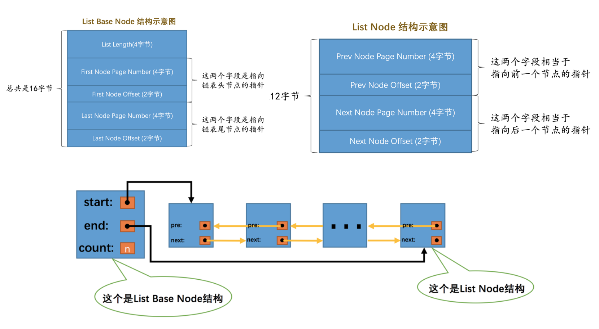
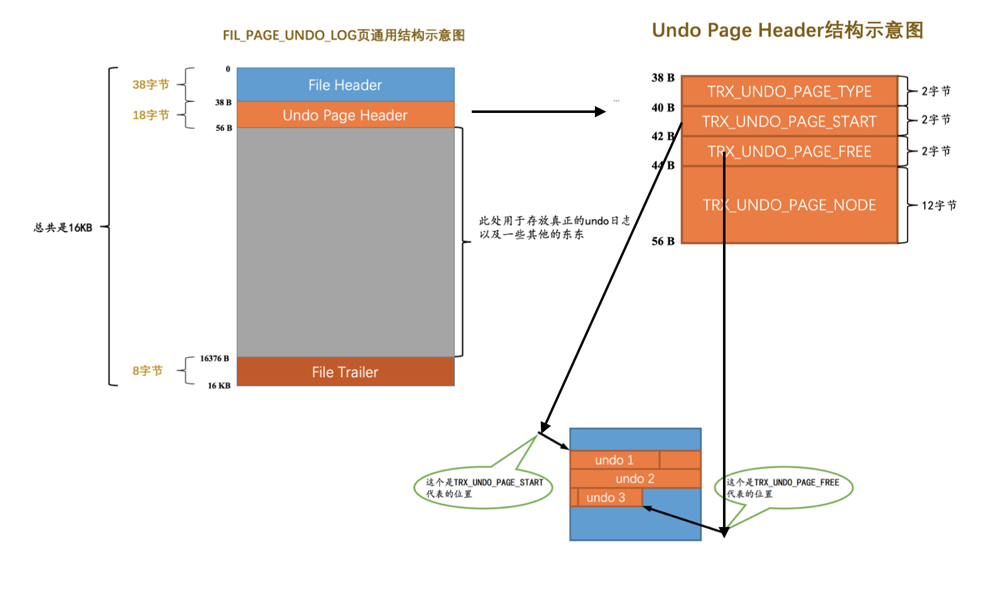
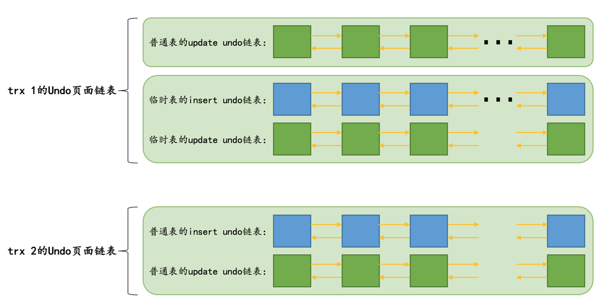
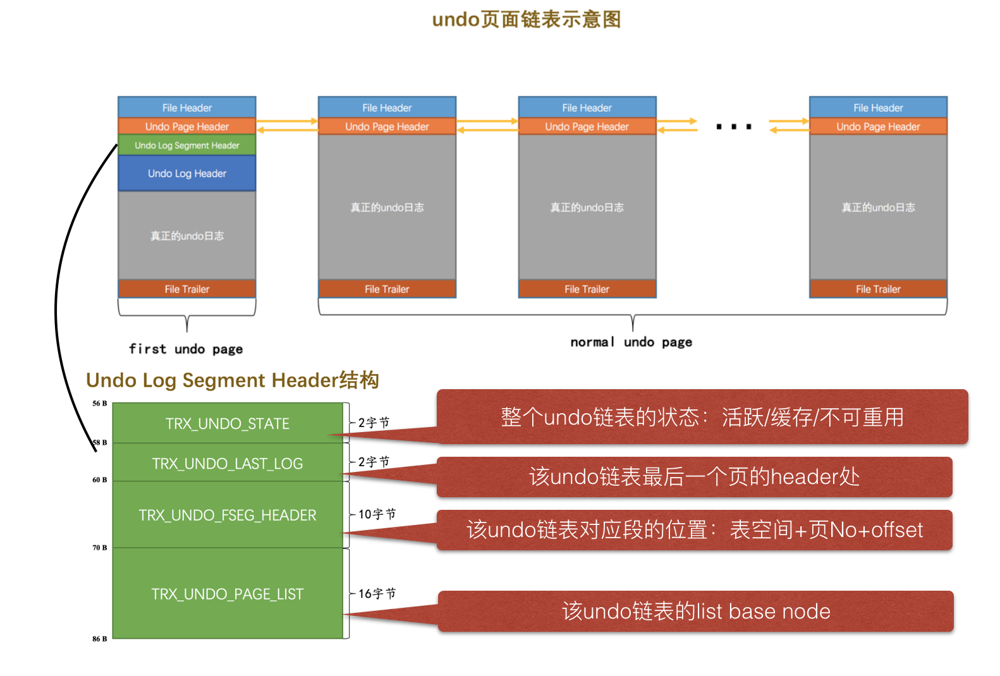
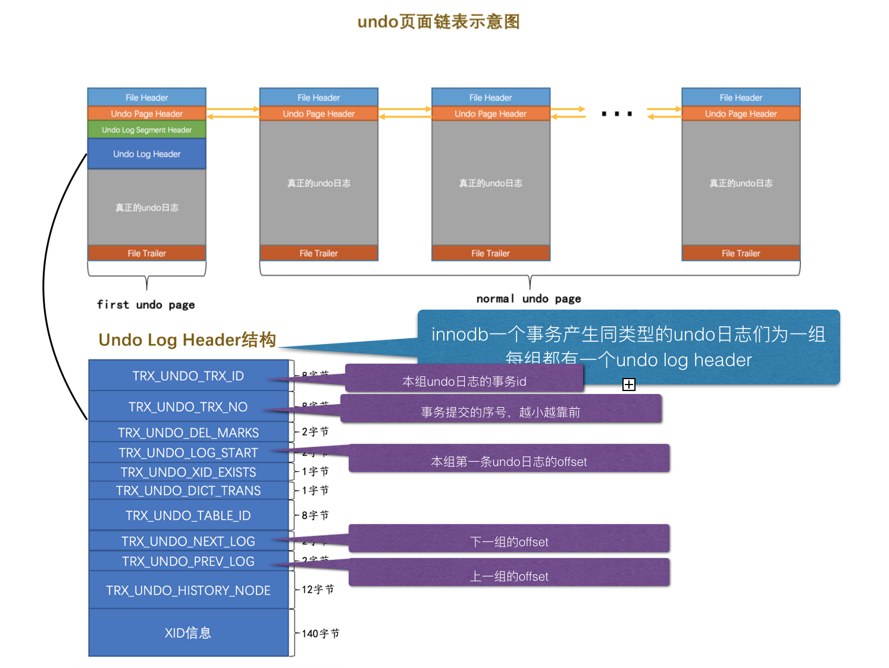
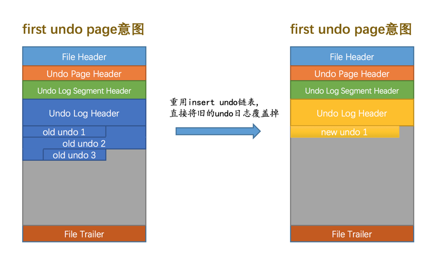
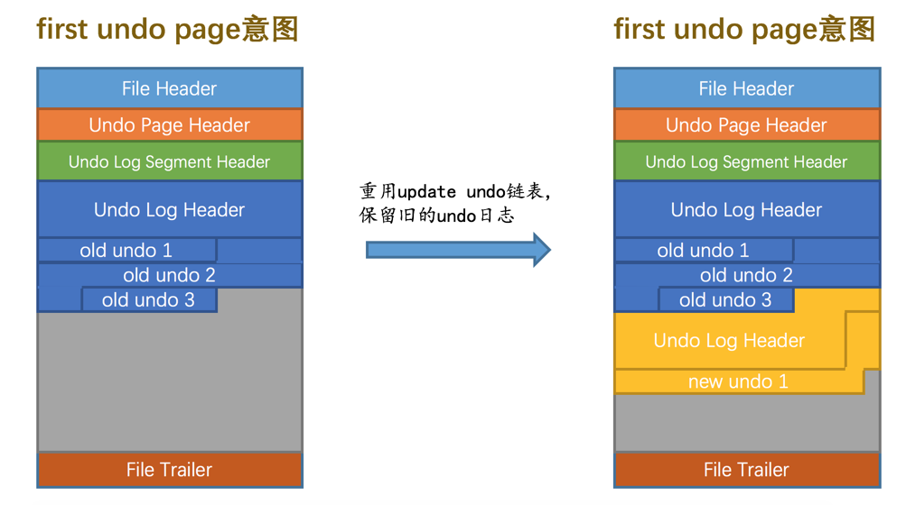
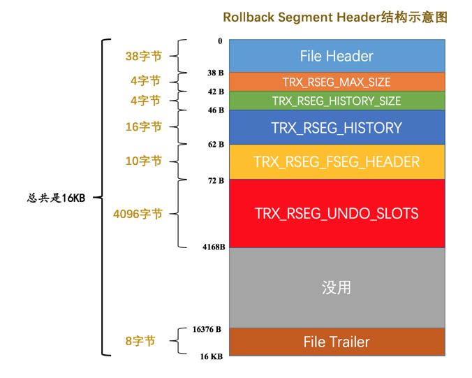
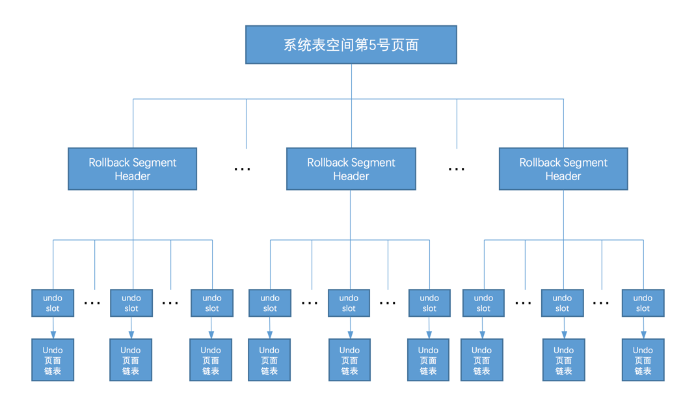

   * [先复习下innodb里面常见的套路：链表 基链表](#先复习下innodb里面常见的套路链表基链表)
   * [介绍下 FIL_PAGE_UNDO_LOG页](#介绍下-fil_page_undo_log页)
   * [undo日志页链表](#undo日志页链表)
* [多个事务的日志页链表](#多个事务的日志页链表)
* [undo链表也有段](#undo链表也有段)
* [undo日志组](#undo日志组)
* [undo日志链表重用](#undo日志链表重用)
  * [事务提交后怎么重用undo日志链表的条件](#事务提交后怎么重用undo日志链表的条件)
  * [不同的重用undo日志的策略](#不同的重用undo日志的策略)
  * [吐槽，为啥insert undo链表和update undo链表待遇不同](#吐槽为啥insert-undo链表和update-undo链表待遇不同)
* [128个回滚段](#128个回滚段)
  * [先看单独一个回滚段](#先看单独一个回滚段)
  * [事务提交后的undo slot的命运](#事务提交后的undo-slot的命运)
  * [多个回滚段](#多个回滚段)
* [整体梳理下为事务分配Undo页面链表的流程](#整体梳理下为事务分配undo页面链表的流程)

# 先复习下innodb里面常见的套路：链表+基链表

# 介绍下 FIL_PAGE_UNDO_LOG页
之前已经知道了，innodb表空间都是一页页的，有很多的页类型，最常见就是如下2个：
* FIL_PAGE_INDEX(索引页，也就是数据页)
* FIL_PAGE_UNDO_LOG(undo日志页)

# undo日志页链表
* 为啥需要undo日志链表
    * 一个事务包含多个SQL语句，一个SQL语句可能改动N条记录，一旦有N处改动，就会有N条undo日志。所以一个事务可能会产生`海量`的undo日志，一个undo页才16KB，很可能要申请贼多的undo页。所以就需要undo页链表。
* 前面我们知道undo日志类型分3种：insert，delete，update，但undo file page的 page type 只能是 insert 和 update
    * 吐槽1：为啥page type只有2个而不是对应3个呢？（少了个delete，把delete和update当成一个page type）
    * 吐槽2：一开始设计为啥要区分page type呢？好像也没看到什么好处。
    * 每个事务根据undo日志类型规分链表：
        * insert类型的undo日志组成一个 insert 链表
        * delete和update类型的undo日志组成一个 update 链表
    * 每个事务的普通表和临时表区分放链表
        * 普通表：insert undo日志链表
        * 普通表：update undo日志链表
        * 临时表：insert undo日志链表
        * 临时表：update undo日志链表
        * 吐槽3：为啥要设计普通表和临时表的区分对待呢？
            * 答案：因为undo日志都要对页面的修改，只要是对页面的修改，就要写redo日志，但是临时表的undo日志系统崩了就崩了，不打算恢复，也没写redo日志。
            * 实现：在修改针对`普通表的回滚段`中的Undo页面时，需要记录对应的redo日志，而修改针对`临时表的回滚段`中的Undo页面时，不需要记录对应的redo日志。    

# 多个事务的日志页链表
上面我们知道了单个事务，就可能产生4个undo日志页链表。

那么如果是多个事务呢？共用？还是再开4个？
答案：**再开4个，互不干扰！**

* ps1：图上所示事务1涉及到临时表，开了3个链表，事务2没涉及到临时表，只开了2个链表，共5个undo页日志链表。
* ps2：感觉好浪费，一个事务可能4个链表，同时这么多事务，有没有可能内存爆了？

# undo链表也有段
* 不知道是不是精神洁癖，innodb作者好像喜欢保持一个原则："页面从段申请而来"，所以undo日志页也有一个段：undo日志段（Undo Log Segment）
* 作者规定了：每一个Undo页面链表都对应着一个段
* 每个段都要管理好手下的undo页链表，段对应一个INODE Entry，肯定要有个地方来存放这个INODE Entry
* 因为有很多undo日志链表，一一对应，必然有很多undo日志段，那么我猜测肯定有一个地方来管理`海量的undo日志段`

我们先看看怎么放这个undo链表的段吧：链表第一个节点加一个undo log segment header即可。

# undo日志组
* 把一个事务中的同类型的undo日志分为一组，每一组都需要一个undo log header，写入undo日志前，先写undo log header。

# undo日志链表重用
## 事务提交后怎么重用undo日志链表的条件
实际上，一旦事务提交了，就没undo日志什么事了，接力棒扔给了redo日志去保驾护航。
而且我们会产生海量的undo日志链表，有些链表是可以被重用的，只要满足以下2个条件:
* 1、整个undo链表只有一个页
    * 假设上一个事务有海量的undo日志页，但我这个事务可能只改了一条记录，undo日志不多，甚至用不了一页，我不想重用它，重用它杀鸡牛刀罢了，所以能被重用的条件：该undo链表只有一个页
* 2、且这个页占用了量很小才能被重用：
    * 该Undo页面已经使用的空间小于整个页面空间的3/4

## 不同的重用undo日志的策略
* insert undo链表
    * 依旧需要满足：该insert undo链表依旧是只有一个undo log页且占用量小于3/4
    * 可以直接把之前事务写入的一组undo日志覆盖掉，从头开始写入新事务的一组undo日志

* update undo链表
    * 依旧需要满足：该insert undo链表依旧是只有一个undo log页且占用量小于3/4
    * 在一个事务提交后，它的update undo链表中的undo日志也不能立即删除掉，需要用于MVCC
    * 所以他只能往后添加，不能像insert 链表一样覆盖    

    
## 吐槽，为啥insert undo链表和update undo链表待遇不同
* insert undo链表在事务提交后随便覆盖
* update undo链表在事务提交后小心翼翼不敢覆盖

原因是: `MVCC`!

# 128个回滚段

## 先看单独一个回滚段
回滚段是什么：
* 帮忙管理海量的undo链表的一个段
* 每个段可以管理1024个链表
* 段里面只要放1024个链表的first page就好了，因为first page自然而然可以找到
* 每个段对应一个undo log segment header：
    

回滚段怎么分配页面：
* 一个回滚段有1024个slot（槽），每个槽可以放一个undo 链表（**的first page**）
* 槽的初始化标记：FIL_NULL，表示这是个处女槽，没人碰过，如果不是FIL_NULL，说明这正在被人用
* 如果1024个槽都是FIL_NULL，说明这1024个undo链表都处于活动状态，无能为力去处理新的事务

## 事务提交后的undo slot的命运
* 如果该undo slot指向的Undo页面链表符合被重用的条件
    * 条件：一个链表只有一个页面且这个页面占比不超过3/4
    * 先把该链表的first page的segment header的状态设置为缓存（TRX_UNDO_CACHED）的状态，表示可重用
    * 根据不同的undo类型插入 insert undo cached链表或update undo cached链表。
* 如果不符合重用的条件
    * 如果是insert undo链表
        * 该链表的first page header的状态设置为TRX_UNDO_TO_FREE，表示可以被释放，然后该undo链表的undo slot置为FIL_NULL
    * 如果是update undo链表
        * TRX_UNDO_TO_PRUGE，则会将该undo slot的值设置为FIL_NULL，然后将本次事务写入的一组undo日志放到所谓的History链表中
        *（需要注意的是，这里并不会将Undo页面链表对应的段给释放掉，因为这些undo日志还有用呢～）
        
        
## 多个回滚段
* 为啥需要多个回滚段
    *  **为了高并发！**
    * 一个回滚段最多只能支持1024个事务（一个事务1个undo 链表），最少只能支持256个事务（一个事务4个undo 链表）远远不够啊。
    * 所以设计了128个回滚段，最高可支持 128 * 1024 = 131072个读写事务同时执行！
* 怎么管理这128个回滚段
    * 128个回滚段就有128个Rollback Segment Header
    * 系统表空间的第5号页面的某个区域包含了 128 个8字节大小的格子，每个格子放一个Rollback Segment Header
    
* 128个回滚段的分配顺序
    * **round-robin（循环使用）**方式来分配回滚段
    * 比如当前事务分配了第0号回滚段，那么下一个事务就要分配第33号回滚段（1-32段给临时表的），下下个事务就要分配第34号回滚段

# 整体梳理下为事务分配Undo页面链表的流程
* 第一个事务，要去系统表空间的第5页求一个回滚段
* 在这个回滚段里面，先根据类型找一下insert undo cached链表或者update undo cached链表
    * 如果cached链表有空闲链表
        * 将cached链表中的第一个空闲链表分配给当前事务
    * 如果cached链表无空闲链表   
        * 遍历1024个undo slot，找到第一个FIL_NULL的undo slot，分配给当前事务
            * 需要重新分配一个Undo Log Segment（记住一个是回滚段Rollback segment，一个是undo日志段）
            * 然后从新申请的Undo Log Segment中申请一个页面作为Undo页面链表的first undo page
        * 如果1024个undo slot都不为FIL_NULL，说明已经满负荷处理事务了，`没资源报错`！
* 拿到这个undo slot后，事务就可以把undo日志写入到上边申请的Undo页面链表了！
