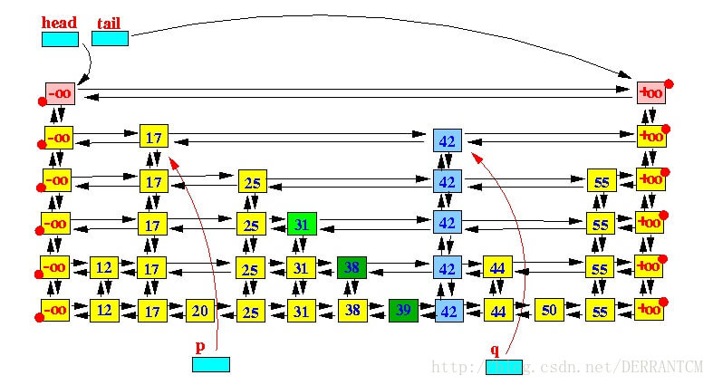

# 跳跃表 SkipList


# 时间复杂度
查找：
```
O(logN)
```
插入：
```
O(logN) = 定位 O(logN) + 常量操作
```
删除:
```
O(logN) = 定位O(logN) + 常量操作
```

# 用途
* Redis的有序集合的实现之一
* Java的 ConcurrentSkipListMap
* Java的 ConcurrentSkipListSet

