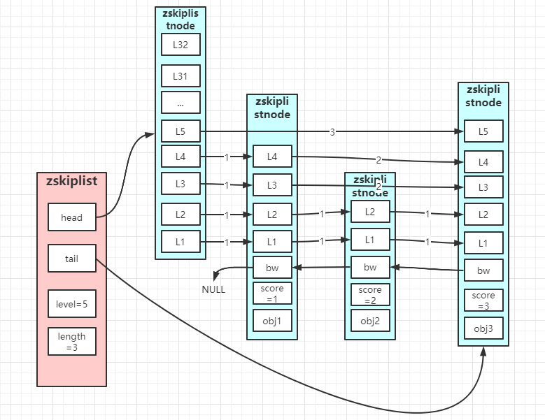

# 跳跃表的实现
zskiplistNode：
```
typedef struct zskiplistNode{
    struct zskiplistLevel {
        // 前进指针
        zskiplistNode *forward;
        
        // 跨度
        int span;
    } level[];
    
    // 后退指针
    struct zskiplistNode *backward;
    double score;
    robj *obj;
} zskiplistNode;
```
zskiplist:
```
typedef struct zskiplist{
    struct zskiplistNode *head;
    structzskiplistNode *tail;
    unsigned long lenght;
    int level;
} zskiplist;
```
zskiplist底层结构：


值得关注：
* backward是为了从后往前遍历的
* score和obj 就是 key和value