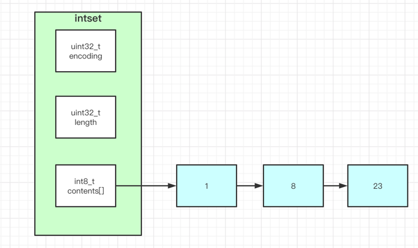
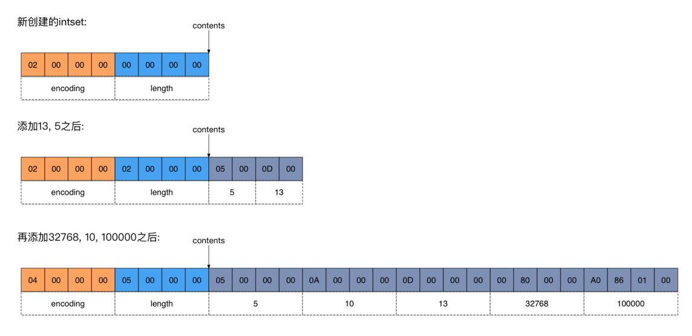

# intset
## 结构图：


struct定义如下：
```
typedef struct intset{
    uint32_t encoding;
    uint32_t length;
    int8_t contents[];
}intset;
```
## 适合场景：
```
当集合中的元素都是整数且元素个数小于set-max-intset-entries配置（默认512个）时，Redis会选用intset来作为集合的内部实现，从而减少内存的使用；
```
intset适合场景，conf 配置如下：
```
➜  cat ~/docker_home/redis/conf/redis.conf | grep --color "set-max-intset-entries"
set-max-intset-entries 512
```

## encoding 编码：
```
#define INTSET_ENC_INT16 (sizeof(int16_t))
#define INTSET_ENC_INT32 (sizeof(int32_t))
#define INTSET_ENC_INT64 (sizeof(int64_t))
```

# 升级:
最节省空间原则：
```dtd
直到遇到有一个int数字比encoding大，才去全体升级encoding。
```
升级图解：


升级需要调整intset的size:
```
// Resize the intset  扩容，重新分配数组的大小, 每次扩容一个元素
static intset *intsetResize(intset *is, uint32_t len) {
    // 计算新增的字节数，因为可能涉及扩容了
    // 比如 len = 11 但是现在编码变成了 INTSET_ENC_INT64，所以要重新计算is 的内存大小
    uint32_t size = len * is->encoding;
    // 重新分配内存
    is = zrealloc(is, sizeof(intset) + size);
    return is;
}
```

升级的好处：
```
最大可能节省内存空间，只有在需要的时候才整体升级；
灵活性：C语言静态语言，定好了数据类型就是定好了，但是这个升级策略可以保证你随意往contents数组加不同类型的int，反正它自己会帮你处理encoding。
```


# 降级：
```
暂不支持
```


# 底层实现：
## 查找元素：
因为要保证整个intset是有序的，所以经常要挪动，要挪动就要知道从哪里开始挪动。定位position代码如下：
```
static uint8_t intsetSearch(intset *is, int64_t value, uint32_t *pos) {
    int min = 0, max = intrev32ifbe(is->length)-1, mid = -1;
    int64_t cur = -1;

    /* 集合为空，直接返回第一个位置 */
    if (intrev32ifbe(is->length) == 0) {
        if (pos) *pos = 0;
        return 0;
    } else {
        /* _intsetGet函数仅仅获取set集合中pos位置的值， 如果待查元素大于集合尾部元素，则直接返回待查元素位置为集合长度*/
        if (value > _intsetGet(is,intrev32ifbe(is->length)-1)) {
            if (pos) *pos = intrev32ifbe(is->length);
            return 0;
        /*如果待查元素小于集合头部元素，则直接返回待查元素位置为0*/
        } else if (value < _intsetGet(is,0)) {
            if (pos) *pos = 0;
            return 0;
        }
    }

    /*二分查找*/
    while(max >= min) {
        mid = ((unsigned int)min + (unsigned int)max) >> 1;
        cur = _intsetGet(is,mid);
        if (value > cur) {
            min = mid+1;
        } else if (value < cur) {
            max = mid-1;
        } else {
            break;
        }
    }
    
    /*找到元素返回1，否则返回0，pos为元素应该位置*/
    if (value == cur) {
        if (pos) *pos = mid;
        return 1;
    } else {
        if (pos) *pos = min;
        return 0;
    }
}
```
其中 `intrev32ifbe` 不用管，他只是帮忙搞定不同操作系统的大端小端，自行脑补以下代码：
```
max = intrev32ifbe(is->length)-1
替换成：
max = is->length-1
```
其中 `is` 自行脑补：
```
is = intset 
```
以下函数部分不用管（`max`定义之后， `二分`之前），这是简单的业务优化罢了：
```
/* 集合为空，直接返回第一个位置 */
if (intrev32ifbe(is->length) == 0) {
    if (pos) *pos = 0;
    return 0;
} else {
    /* _intsetGet函数仅仅获取set集合中pos位置的值， 如果待查元素大于集合尾部元素，则直接返回待查元素位置为集合长度*/
    if (value > _intsetGet(is,intrev32ifbe(is->length)-1)) {
        if (pos) *pos = intrev32ifbe(is->length);
        return 0;
    /*如果待查元素小于集合头部元素，则直接返回待查元素位置为0*/
    } else if (value < _intsetGet(is,0)) {
        if (pos) *pos = 0;
        return 0;
    }
}
```
所以最终查找代码可以优化成最常见的二分算法模板：
```
static uint8_t intsetSearch(intset *is, int64_t value, uint32_t *pos) {
    int min = 0, max = is->length-1, mid = -1;
    int64_t cur = -1;

    /*二分查找*/
    while(max >= min) {
        mid = ((unsigned int)min + (unsigned int)max) >> 1;
        cur = _intsetGet(is,mid);
        if (value > cur) {
            min = mid+1;
        } else if (value < cur) {
            max = mid-1;
        } else {
            break;
        }
    }
    
    /*找到元素返回1，否则返回0，pos为元素应该位置*/
    if (value == cur) {
        if (pos) *pos = mid;
        return 1;
    } else {
        if (pos) *pos = min;
        return 0;
    }
}
```

## 挪动 contents 元素
新增和删除都要挪动，简单的代码往前往后覆盖，时间复杂度：O(N)。
比如插入：
```
intset *intsetAdd(intset *is, int64_t value, uint8_t *success) {
    uint8_t valenc = _intsetValueEncoding(value);
    uint32_t pos;
    if (success) *success = 1;

    /* Upgrade encoding if necessary. If we need to upgrade, we know that
     * this value should be either appended (if > 0) or prepended (if < 0),
     * because it lies outside the range of existing values. */
    if (valenc > intrev32ifbe(is->encoding)) {
        /* This always succeeds, so we don't need to curry *success. */
        return intsetUpgradeAndAdd(is,value);
    } else {
        /* Abort if the value is already present in the set.
         * This call will populate "pos" with the right position to insert
         * the value when it cannot be found. */
        if (intsetSearch(is,value,&pos)) {
            if (success) *success = 0;
            return is;
        }

        is = intsetResize(is,intrev32ifbe(is->length)+1);
        if (pos < intrev32ifbe(is->length)) intsetMoveTail(is,pos,pos+1);
    }

    _intsetSet(is,pos,value);
    is->length = intrev32ifbe(intrev32ifbe(is->length)+1);
    return is;
}
```
按照自行脑补优化代码：
```
intset *intsetAdd(intset *is, int64_t value, uint8_t *success) {
    uint8_t valenc = _intsetValueEncoding(value);
    uint32_t pos;
    if (success) *success = 1;

    // 判断下是否需要升级 encoding
    if (valenc > intrev32ifbe(is->encoding)) {
        // 先升级，再插入
        return intsetUpgradeAndAdd(is,value);
    } else {
        // 如果该元素已经存在于集合中，跳出，插入失败
        if (intsetSearch(is,value,&pos)) {
            if (success) *success = 0;
            return is;
        }
        
        // 调整intset的大小，具体大小应该 == intset.length +1
        is = intsetResize(is,is->length+1);

        // 因为已经定位到了要插入的问题，所以position后面的都往后挪一步
        if (pos < is->length) intsetMoveTail(is,pos,pos+1);
    }
    
    // 正式插入该元素
    _intsetSet(is,pos,value);

    // 调整intset的length, 也就是单纯的intset.length ++
    is->length = is->length+1);
    return is;
}
```

上面的函数可看出，如果不需要升级编码还是挺简单的，升级的核心代码是： `intsetUpgradeAndAdd`
```
static intset *intsetUpgradeAndAdd(intset *is, int64_t value) {
    // 旧的编码格式
    uint8_t curenc = intrev32ifbe(is->encoding);
    // 插入元素的编码格式
    uint8_t newenc = _intsetValueEncoding(value);
    int length = intrev32ifbe(is->length);
    // 该值是用来判断 value 在 beginning 还是 end 位置插入的标志
    int prepend = value < 0 ? 1 : 0;

    /* First set new encoding and resize */
    is->encoding = intrev32ifbe(newenc);
    // 扩容一个元素
    is = intsetResize(is, intrev32ifbe(is->length) + 1);

    while (length--)
        _intsetSet(is, length + prepend, _intsetGetEncoded(is, length, curenc));

    /* Set the value at the beginning or the end. */
    if (prepend)
        _intsetSet(is, 0, value);
    else
        _intsetSet(is, intrev32ifbe(is->length), value);
    is->length = intrev32ifbe(intrev32ifbe(is->length) + 1);
    return is;
}
```
我们脑补精简后代码如下(请注意这个函数的进入时机，要么极大要么极小)：
```
// 这么说吧，能进来这个函数的value只有2个情况，要么最大，要么最小
// 所以这里面的挪动元素操作很简单，全部右移动1位，或者全部不动弹

static intset *intsetUpgradeAndAdd(intset *is, int64_t value) {
    // 旧的编码格式
    uint8_t curenc = is->encoding;

    // 插入元素的编码格式
    uint8_t newenc = _intsetValueEncoding(value);

    int length = is->length;

    // 该值是用来判断 value 在 beginning 还是 end 位置插入的标志
    int prepend = value < 0 ? 1 : 0;

    // 设置新的编码 
    is->encoding = newenc;

    // 扩容一个元素
    is = intsetResize(is, is->length + 1);
    
    // 整体全部往后挪动一位，或者全部不动弹！！！
    while (length--)
        _intsetSet(is, length + prepend, _intsetGetEncoded(is, length, curenc));

    // 插入元素： 如果是最小，就插到第一个位置.否则就插入到最后一个位置 
    if (prepend)
        _intsetSet(is, 0, value);
    else
        _intsetSet(is, is->length, value);
    
    // intset 的length ++
    is->length = is->length + 1;
    return is;
}
```