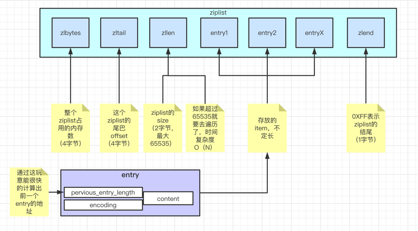
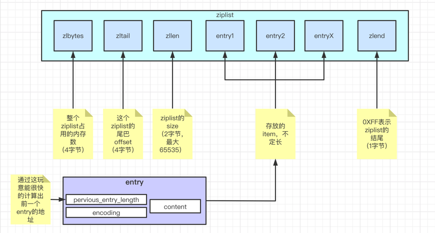
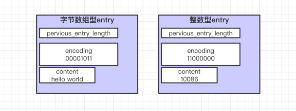
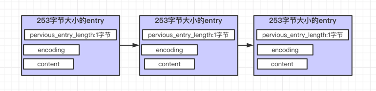
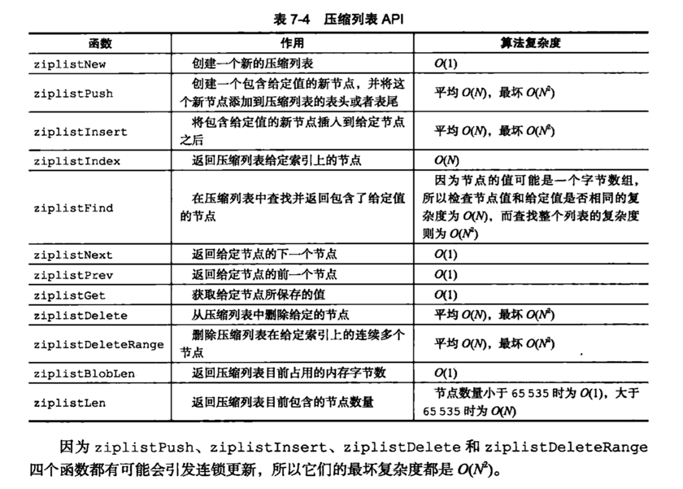

# ziplist
解释：
```
压缩列表，适合数量较少的情况，然后列表里面有小int，也有短str
```
使用示例：
```
127.0.0.1:6379> rpush test_ziplist 1 2 3 "a" "b" "c"
(integer) 6
127.0.0.1:6379>
127.0.0.1:6379> lrange test_ziplist 0 -1
1) "1"
2) "2"
3) "3"
4) "a"
5) "b"
6) "c"
127.0.0.1:6379> object encoding test_ziplist
"quicklist"
```

其实quicklist的底层是：
```
A doubly linked list of ziplists
```

redis conf配置:
```
# Compress depth is the number of quicklist ziplist nodes from *each* side of
zset-max-ziplist-entries 128
zset-max-ziplist-value 64
```

ziplist底层结构： 


# 压缩列表的结点


快速从尾往前遍历entry：
```
如上图 previous_entry_length 可以快速根据当前entry指针p得到上一个entry的指针p1（p-previous_entry_length即可）
```

## 压缩列表结点的 previous_entry_length
|长度|结点实际大小|样例|
|:---|----| ---| 
|1字节| < 254字节| 0x05  表示 5 个字节|
|5字节| >= 254 字节| 0xFE00002677 表示 10068个字节，其中第一个字节FE为固定|

## 压缩列表结点的 encoding

|编码|种类|长度| 说明|
|:---|----|----| ---|
|00bbbbbb| 字节数组 | 1字节 | < 2^6 字节的字节数组
|01bbbbbb xxxxxxxx| 字节数组|2字节| < 2^14 字节的字节数组|
|10bbbbbb aaaaaaaa bbbbbbbb cccccccc dddddddd|字节数组| 5字节| < 2^32字节的字节数组（40亿？？）|
|11000000|int整数| 1字节| int16_t的整数|
|11010000|int整数| 1字节| int32_t的整数|
|11100000|int整数| 1字节| int64_t的整数|
|11110000|int整数| 1字节| 24位有符号的整数|
|11111110|int整数| 1字节| 8位有符号整数|
|1111xxxx|int整数| 1字节| 这个编码没有对应的content字段，因为xxxx本身就可以保存一个0-12（为啥不是0-15??）的整数啦|

## 压缩列表结点的 content




# 连锁更新

结点更新定义：
```
为了让压缩列表的每个结点的 previous_entry_length 都符合要求，需要对压缩列表进行空间重分配操作。
```
每次空间重分配的最坏时间复杂度：
```
O(N)
```
连锁更新定义：
```
在特殊情况下，连续多次空间扩展操作被称之为连锁更新。
```
最坏情况下要对N个结点进行空间重分配，时间复杂度：
```
O(N^2)
```

有这么一个特殊情况：

然后往中间加一个10086字节大小的entry：


## AIP列表


### 寻找第 index 个结点
其实看到这个AIP列表还是挺惊讶的，我从一个"链表"的指定index返回一个entry结点，需要O(N)??
好像也需要哦：
```

/* Returns an offset to use for iterating with ziplistNext. When the given
 * index is negative, the list is traversed back to front. When the list
 * doesn't contain an element at the provided index, NULL is returned. */
unsigned char *ziplistIndex(unsigned char *zl, int index) {
    unsigned char *p;
    unsigned int prevlensize, prevlen = 0;
    if (index < 0) {
        index = (-index)-1;
        p = ZIPLIST_ENTRY_TAIL(zl);
        if (p[0] != ZIP_END) {
            ZIP_DECODE_PREVLEN(p, prevlensize, prevlen);
            while (prevlen > 0 && index--) {
                p -= prevlen;
                ZIP_DECODE_PREVLEN(p, prevlensize, prevlen);
            }
        }
    } else {
        p = ZIPLIST_ENTRY_HEAD(zl);
        while (p[0] != ZIP_END && index--) {
            p += zipRawEntryLength(p);
        }
    }
    return (p[0] == ZIP_END || index > 0) ? NULL : p;
}
```
翻译下就是：
```
unsigned char *ziplistIndex(unsigned char *zl, int index) {
    unsigned char *p;
    unsigned int prevlensize, prevlen = 0;

    // 如果你想从尾巴往前数 index 个
    if (index < 0) {
        index = (-index)-1;
        p = ZIPLIST_ENTRY_TAIL(zl);
        if (p[0] != ZIP_END) {
            ZIP_DECODE_PREVLEN(p, prevlensize, prevlen);
            while (prevlen > 0 && index--) {
                p -= prevlen;
                ZIP_DECODE_PREVLEN(p, prevlensize, prevlen);
            }
        }
    } else {
        // 如果你单纯从头往前数 index 个
        // 从头开始，不断遍历直到耗尽 index 即可
        p = ZIPLIST_ENTRY_HEAD(zl);
        while (p[0] != ZIP_END && index--) {
            p += zipRawEntryLength(p);
        }
    }
    return (p[0] == ZIP_END || index > 0) ? NULL : p;
}
```

### 查找某个entry
```
/* Find pointer to the entry equal to the specified entry. Skip 'skip' entries
 * between every comparison. Returns NULL when the field could not be found. */
unsigned char *ziplistFind(unsigned char *p, unsigned char *vstr, unsigned int vlen, unsigned int skip) {
    int skipcnt = 0;
    unsigned char vencoding = 0;
    long long vll = 0;

    while (p[0] != ZIP_END) {
        unsigned int prevlensize, encoding, lensize, len;
        unsigned char *q;

        ZIP_DECODE_PREVLENSIZE(p, prevlensize);
        ZIP_DECODE_LENGTH(p + prevlensize, encoding, lensize, len);
        q = p + prevlensize + lensize;

        if (skipcnt == 0) {
            /* Compare current entry with specified entry */
            // 判断 entry 是 字节数组，如果是就返回找到啦，否则继续往后遍历
            if (ZIP_IS_STR(encoding)) {
                // 比较两个字节数组是否相等
                if (len == vlen && memcmp(q, vstr, vlen) == 0) {
                    return p;
                }
            } else {
                // 判断 entry 是 整数
                if (vencoding == 0) {
                    // 这里不能为0，如果是0，我就把它设置为字节数组
                    if (!zipTryEncoding(vstr, vlen, &vll, &vencoding)) {
                        vencoding = UCHAR_MAX;
                    }
                    /* Must be non-zero by now */
                    assert(vencoding);
                }

                // 如果是整数，试着比较一下，如果是，说明找到了entry，否则继续往后找
                if (vencoding != UCHAR_MAX) {
                    long long ll = zipLoadInteger(q, encoding);
                    if (ll == vll) {
                        return p;
                    }
                }
            }

            /* Reset skip count */
            skipcnt = skip;
        } else {
            /* Skip entry */
            skipcnt--;
        }

        /* Move to next entry */
        p = q + len;
    }

    return NULL;
}

``` 
总结起来，查找效率低，时间复杂度O(N)：
```
无论是根据index查找entry，还是根据 *vstr 查找entry，都要从头到尾遍历，时间复杂度 O(N)
```

## hset采用的是ziplist还是hashtable
而据我说知，HSET 底层所使用的数据结构正是上面所说的 `ziplist`，而不是平时所说的 `hashtable`：
* 首先 ziplist 比 hashtable 更**节省内存**
* redis 考虑到如果数据紧凑的 ziplist 能够放入 **CPU 缓存**（hashtable 很难，因为它是非线性的），那么查找算法甚至会比 hashtable 要快！