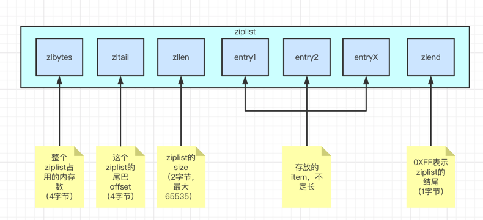

# ziplist
解释：
```
压缩列表，适合数量较少的情况，然后列表里面有小int，也有短str
```
使用示例：
```
127.0.0.1:6379> rpush test_ziplist 1 2 3 "a" "b" "c"
(integer) 6
127.0.0.1:6379>
127.0.0.1:6379> lrange test_ziplist 0 -1
1) "1"
2) "2"
3) "3"
4) "a"
5) "b"
6) "c"
127.0.0.1:6379> object encoding test_ziplist
"quicklist"
```

其实quicklist的底层是：
```
A doubly linked list of ziplists
```

redis conf配置:
```
# Compress depth is the number of quicklist ziplist nodes from *each* side of
zset-max-ziplist-entries 128
zset-max-ziplist-value 64
```

ziplist底层结构： 


# 压缩列表的结点


快速从尾往前遍历entry：
```
如上图 previous_entry_length 可以快速根据当前entry指针p得到上一个entry的指针p1（p-previous_entry_length即可）
```

## 压缩列表结点的 previous_entry_length
|长度|结点实际大小|样例|
|:---|----| ---| 
|1字节| < 254字节| 0x05  表示 5 个字节|
|5字节| >= 254 字节| 0xFE00002677 表示 10068个字节，其中第一个字节FE为固定|

## 压缩列表结点的 encoding

|编码|种类|长度| 说明|
|:---|----|----| ---|
|00bbbbbb| 字节数组 | 1字节 | < 2^6 字节的字节数组
|01bbbbbb xxxxxxxx| 字节数组|2字节| < 2^14 字节的字节数组|
|10bbbbbb aaaaaaaa bbbbbbbb cccccccc dddddddd|字节数组| 5字节| < 2^32字节的字节数组（40亿？？）|
|11000000|int整数| 1字节| int16_t的整数|
|11010000|int整数| 1字节| int32_t的整数|
|11100000|int整数| 1字节| int64_t的整数|
|11110000|int整数| 1字节| 24位有符号的整数|
|11111110|int整数| 1字节| 8位有符号整数|
|1111xxxx|int整数| 1字节| 这个编码没有对应的content字段，因为xxxx本身就可以保存一个0-12（为啥不是0-15??）的整数啦|

## 压缩列表结点的 content


