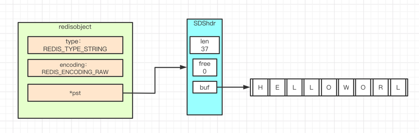
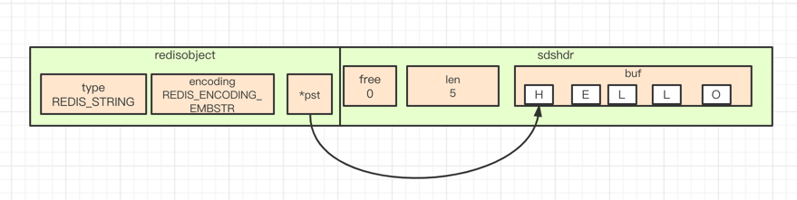

# 字符串对象raw编码实现




# 字符串对象embstr编码实现



何时用raw编码和何时用embstr编码：
```
3.2版本之前  embstr 编码是以 39 为界限了
3.2版本之后  embstr 编码是以 44 为界限了
```

有没有可能3个字符也用raw编码？
```
127.0.0.1:6379> set story ab
OK
127.0.0.1:6379> object encoding story
"embstr"
127.0.0.1:6379> append story c
(integer) 3
127.0.0.1:6379> get story
"abc"
127.0.0.1:6379> object encoding story
"raw"
```
解释：
```
embstr没办法调用append()，先转成raw对象后再调用append()。
```
除了append会转换embstr的对象，还有什么函数会呢？
```
1、append()
2、setrange()
```
看起来是只要改了就会生成一个raw对象。