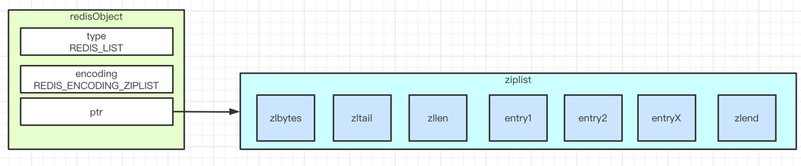
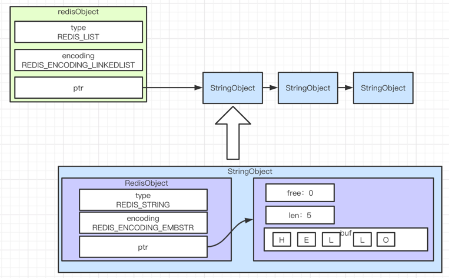
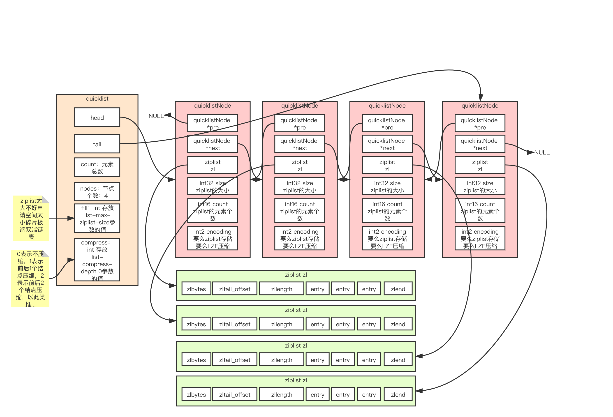

# redisObject 
```
    typedef struct redisObject {
        unsigned type:4;
        unsigned encoding:4;
        unsigned lru:LRU_BITS; /* lru time (relative to server.lruclock) */
        int refcount; // 引用次数，为0可以删除
        void *ptr; // value具体的指针 
    } robj;
```

# ziplist实现的列表


# 双端链表实现的列表


# 何时ziplist何时linkedlist
```
list-max-ziplist-entries 512
list-max-ziplist-value 64
```
`list-max-ziplist-entries 512` 解读：
```
列表元素数量 <= 512个
```
`list-max-ziplist-value 64` 解读：
```
列表的任意一个元素的长度不超过64字节
```

# Redis 3.2 之后quicklist一统江湖
quicklist:
```
typedef struct quicklist {
    quicklistNode *head;
    quicklistNode *tail;
    unsigned long count;        /* total count of all entries in all ziplists */
    unsigned long len;          /* number of quicklistNodes */
    int fill : QL_FILL_BITS;              /* fill factor for individual nodes */
    unsigned int compress : QL_COMP_BITS; /* depth of end nodes not to compress;0=off */
    unsigned int bookmark_count: QL_BM_BITS;
    quicklistBookmark bookmarks[];
} quicklist;
```
quicklistNode:
```
struct quicklistNode{
    quicklistNode* prev;    //前一个节点
    quicklistNode* next;    //后一个节点
    ziplist* zl;            //压缩列表
    int32 size;                //ziplist大小
    int16 count;            //ziplist 中元素数量
    int2 encoding;            //编码形式 存储 ziplist 还是进行 LZF 压缩储存
    ...
}
```

quicklist底层结构图： 



# quicklistNode 里面的 ziplist 大小的忧虑
ziplist 太小：
```
1、一堆内存碎片；
2、极端情况下，就退化成双端链表去处理。
```
ziplist 太大：
```
1、无法充分利用空间，明明加起来足够的内存，就是死活申请不下来。
```
和mysql一样，这种无法编程解决的问题，就丢给程序员去处理：
```
list-max-ziplist-size -2
```
`list-max-ziplist-size` 正数比如5：
```
表示ziplist里面entries的个数最大不能超过5
```
`list-max-ziplist-size` 负数比如-5：
```
表示ziplist整个大小不能超过64kB：
```
`list-max-ziplist-size` 负数取值：
```
-1 每个节点的ziplist字节大小不能超过4kb
-2 每个节点的ziplist字节大小不能超过8kb
-3 每个节点的ziplist字节大小不能超过16kb
-4 每个节点的ziplist字节大小不能超过32kb
-5 每个节点的ziplist字节大小不能超过64kb

```

