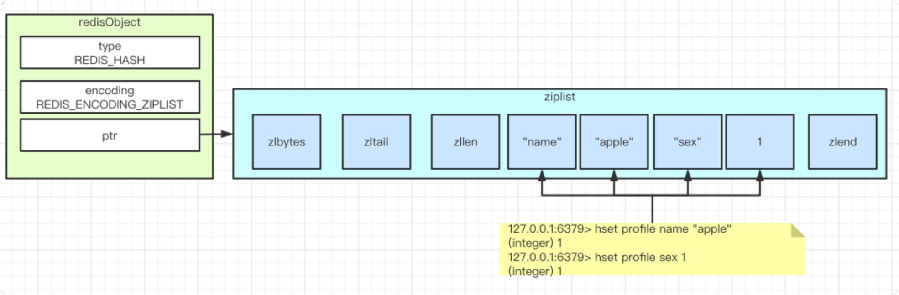
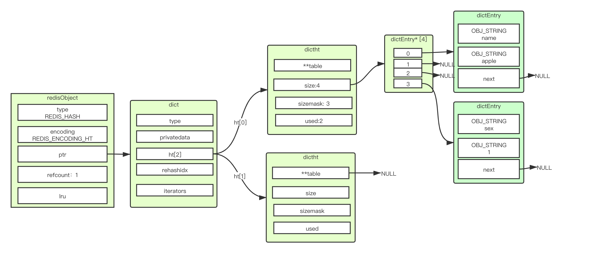

# ziplist实现的哈希对象
要点1：
```
key和value挨着一起，插入ziplist
```
要点2：
```
先添加的key-value靠近ziplist的头，后添加的key-value靠近ziplist的尾巴
```
结构图：



# hashtable 实现的哈希对象


  
# ziplist 和 hashtable 编码的转换契机
```
➜  conf cat redis.conf | grep --color "list-"
# 不超过512个 entry
hash-max-ziplist-entries 512
# 每个 entry 不超过64字节
hash-max-ziplist-value 64
```
我们测试下64个字节:
```
127.0.0.1:6379>
127.0.0.1:6379> hset profile age "aaaaaaaaaabbbbbbbbbbccccccccccddddddddddeeeeeeeeeeffffffffffgggg"
(integer) 1
127.0.0.1:6379> object encoding profile
"ziplist"

```
我们测试下65个字节:
```
127.0.0.1:6379> hset profile age1 "aaaaaaaaaabbbbbbbbbbccccccccccddddddddddeeeeeeeeeeffffffffffggggg"
(integer) 1
127.0.0.1:6379> object encoding profile
"hashtable"
```