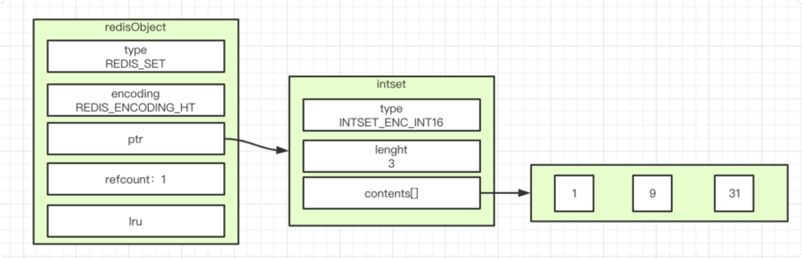
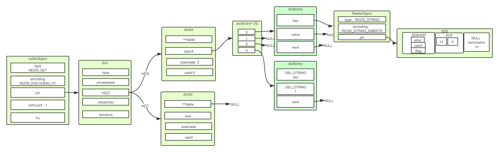

# intset编码实现的集合对象
intset编码两个条件：
```
1、都是int数；
2、items <= 512
```
配置：
```
➜  conf cat redis.conf | grep --color "set-max-intset-entries"
set-max-intset-entries 512
```
结构图：

 
# hashtable编码实现的集合对象


# 何时用intset何时用hashtable
512个元素就是intset：
```
127.0.0.1:6379> eval "for i=1,512 do redis.call('SADD', KEYS[1], i) end" 1 integers
127.0.0.1:6379>
127.0.0.1:6379> scard integers
(integer) 512
127.0.0.1:6379> object encoding integers
"intset"
```
513个元素就是hashtable：
```
127.0.0.1:6379> SADD integers 513
(integer) 1
127.0.0.1:6379> object encoding integers
"hashtable"
```
