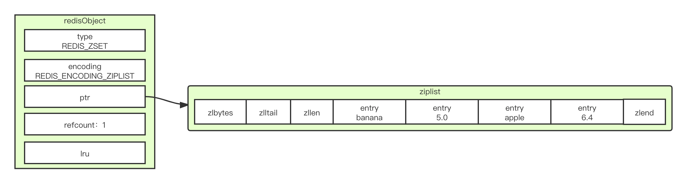
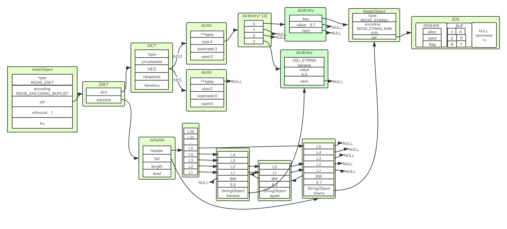

数据结构：
```
/*
 * 有序集
 */
typedef struct zset {

    // 字典
    dict *dict;

    // 跳跃表
    zskiplist *zsl;

} zset;
```

# ziplist编码实现的zset


# skiplist + dict编码实现的zset




# 何时用ziplist何时用skiplist
毕竟ziplist都是遍历，所以太多元素会影响性能，这里默认控制128个，每个不超过64字节。
```
➜  conf cat redis.conf | grep --color "zset"
zset-max-ziplist-entries 128
zset-max-ziplist-value 64
```