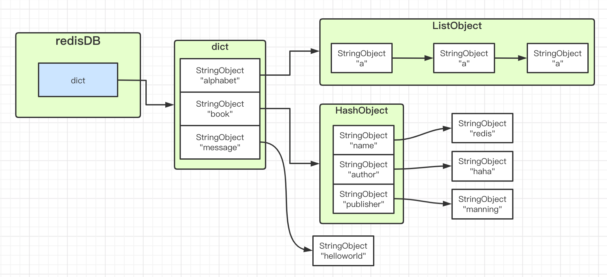
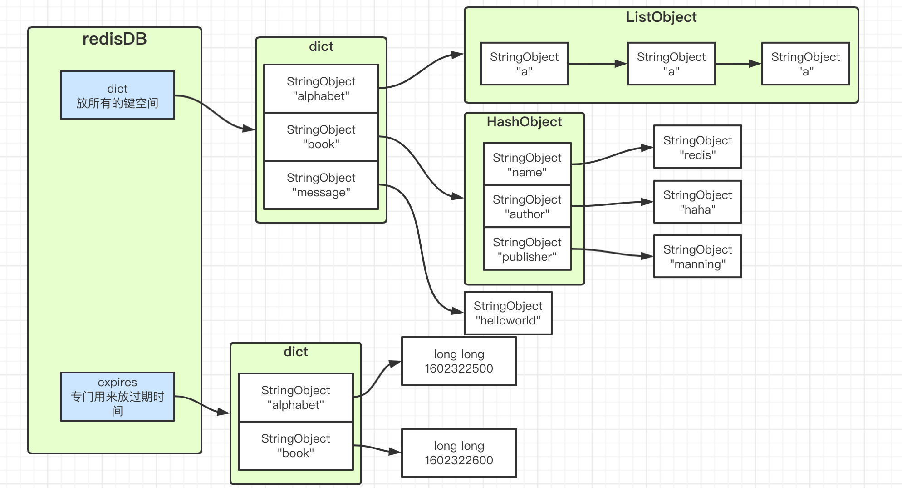

# 服务器的数据库
redisServer结构体维护redis服务器的状态，里面有`400`行！
```
struct redisServer {
    // ...
    redisDb *db;
    int dbnum;                      /* Total number of configured DBs */
    // ...
}
```
redisClient（新版本改名为client啦）结构体维护着客户端的状态：
```
typedef struct client {
    uint64_t id;            /* Client incremental unique ID. */
    connection *conn;
    int resp;               /* RESP protocol version. Can be 2 or 3. */
    redisDb *db;            /* Pointer to currently SELECTed DB. */
    // ....many many fileds 
} client;
```

关键的数据库 redisDb结构：
```
/* Redis database representation. There are multiple databases identified
 * by integers from 0 (the default database) up to the max configured
 * database. The database number is the 'id' field in the structure. */
typedef struct redisDb {
    dict *dict;                 /* The keyspace for this DB */
    dict *expires;              /* Timeout of keys with a timeout set */
    dict *blocking_keys;        /* Keys with clients waiting for data (BLPOP)*/
    dict *ready_keys;           /* Blocked keys that received a PUSH */
    dict *watched_keys;         /* WATCHED keys for MULTI/EXEC CAS */
    int id;                     /* Database ID */
    long long avg_ttl;          /* Average TTL, just for stats */
    unsigned long expires_cursor; /* Cursor of the active expire cycle. */
    list *defrag_later;         /* List of key names to attempt to defrag one by one, gradually. */
} redisDb;
```

其中redisDB的底层结构图如下，核心是dict，键空间：



redisDB中的expires字段，用于存放所有的键的ttl：


上面图片解释，虽然出现2个book和alphabet，但实际上都是指针，不会重复创建对象。