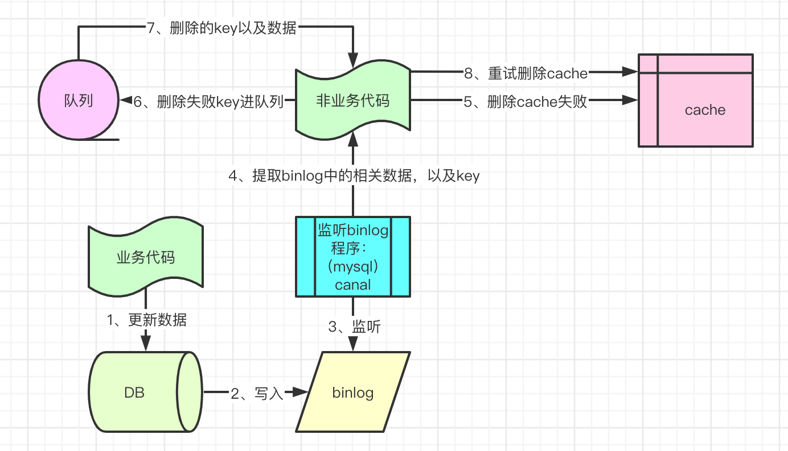

# 缓存数据库双写一致性的常用策略
* 根正苗红： cache-aside-pattern
* 精神病人思路广：延时双删
* 绝对一致性： 订阅binlog
* 高富帅之cache自己搞定一致性：read-through \ write-through
* 双刃剑：write behind

## cache-aside-pattern
这个缓存边缘策略，是一个处理缓存与数据库一致性矛盾的策略思想。
cache与DB，无非是以下几个可能性：
* 先操作DB，再操作Cache
* 先操作Cache，再操作DB
* 操作Cache时是更新Cache
* 操作Cache时是删除Cache

`cache-aside-pattern` 读数据伪代码如下：
```
// Set five minute expiration as a default
private const double DefaultExpirationTimeInMinutes = 5.0;

public async Task<MyEntity> GetMyEntityAsync(int id)
{
  // Define a unique key for this method and its parameters.
  var key = $"MyEntity:{id}";
  var cache = Connection.GetDatabase();

  // Try to get the entity from the cache.
  var json = await cache.StringGetAsync(key).ConfigureAwait(false);
  var value = string.IsNullOrWhiteSpace(json)
                ? default(MyEntity)
                : JsonConvert.DeserializeObject<MyEntity>(json);

  if (value == null) // Cache miss
  {
    // If there's a cache miss, get the entity from the original store and cache it.
    // Code has been omitted because it is data store dependent.
    value = ...;

    // Avoid caching a null value.
    if (value != null)
    {
      // Put the item in the cache with a custom expiration time that
      // depends on how critical it is to have stale data.
      await cache.StringSetAsync(key, JsonConvert.SerializeObject(value)).ConfigureAwait(false);
      await cache.KeyExpireAsync(key, TimeSpan.FromMinutes(DefaultExpirationTimeInMinutes)).ConfigureAwait(false);
    }
  }

  return value;
}
```

`cache-aside-pattern` 写数据伪代码如下：
```
public async Task UpdateEntityAsync(MyEntity entity)
{
    // Update the object in the original data store.
    await this.store.UpdateEntityAsync(entity).ConfigureAwait(false);

    // Invalidate the current cache object.
    var cache = Connection.GetDatabase();
    var id = entity.Id;
    var key = $"MyEntity:{id}"; // The key for the cached object.
    await cache.KeyDeleteAsync(key).ConfigureAwait(false); // Delete this key from the cache.
}
```
操作Cache时，`不会更新`而是`直接删除`的原因：
```
1、lazy load，减少无用的操作，提高系统性能；
2、如果更新缓存，在并发情况下可能导致缓存数据异常，如 redis key lpush，可能会push double的脏数据。
```
`Cache-aside-pattern`先更新DB再删除Cache的原因：
```
The order of the steps is important. 
Update the data store before removing the item from the cache. 
If you remove the cached item first, there is a small window of time when a client might fetch the item before the data store is updated. 
That will result in a cache miss (because the item was removed from the cache), causing the earlier version of the item to be fetched from the data store and added back into the cache. 
The result will be stale cache data.
翻译下就是：
如果先删除Cache再更新DB，有个空窗时间，这个时间段中如果有查询过来，会更新旧数据到Cache进而引发Cache与DB不一致。
```
我本人的疑惑：
```
如果先更新DB再删除Cache，DB更新完毕，但是通知Cache删除的时候失败，也会导致两边数据不一致，怎么办？
```
本人自己的回答：
```
1、没有绝对完美的答案，很多设计都是取舍；
2、上面的先删除Cache再更新DB 和 先更新DB再删除Cache，有个核心问题，就是概率，你觉得操作redis失败的概率高还是遇到读写并发的概率高？
3、人家微软、facebook都是用cache-aside-pattern，并不是没有道理的，经得起考验。
4、58同城用的是先更新DB再删除Cache，理由就是redis操作可能会失败，这点我不认可。
```
这个`cache-aside-pattern`绝对没有并发问题吗？
```
1、目前没有Cache，读操作需要去DB拉取数据后更新到Cache中（此时的数据版本V1）；
2、此时此刻来一个写操作，它更新完DB后（此时的数据版本V2），把Cache删除；
3、步骤2比步骤1执行更快，所以不会影响步骤1的Cache写入；
4、所以最后Cache的数据是V1,DB的数据是V2，数据不一致。
```
可能会遇到数据不一致的情况，但概率太低了：
```
1、刚好要遇到缓存失效的情况；
2、必须先来一个读操作，再来一个写操作，但是写操作一般是耗时远大于读操作的，结果你还要求人家写操作先执行完毕；
```
但实在没办法，facebook和微软都建议加一个ttl，遇到那种异常情况，就等待自动删除就行了。

## 先删除cache再更新DB + 延时双删
有些架构师针对一致性给的答案是：
```
1、先删除cache再更新DB；
2、然后为了防止这段时间有人读操作导致cache，延时1秒再删一次。
```
真的是思路广啊，伪代码如下：
```
public void write(String key,Object data){
    redis.delKey(key);
    db.updateData(data);
    Thread.sleep(1000);
    redis.delKey(key);
}
```
但是线上不可以真的sleep一秒，所以可以采取异步线程去做第二次删除，伪代码：
```
public void write(String key,Object data){
    redis.delKey(key);
    db.updateData(data);
    asyncDelete(key, 1000);
}

private void asyncDelete(String key, long microSeconds){
    Thread.sleep(microSeconds);
    redis.delKey(key);
}
```
如果第二次删除也失败了？其实这个问题和上述的`cache-aside-pattern`的问题一样，就是删除cache失败了，无能为力：
```
这种情况还是可能会出现数据不一致，但是概率比较低，首先必须出现读写竞争，然后写操作第二次删除key还得失败。
概率低的话可以用ttl定时删除即可。
```

## 专业抬杠，我就是要保证绝对的数据一致性！
先说明：因为是Cache与DB是两个中间件，不可能处于同一个事务什么的，只能通过额外的手段来保证最终一致性。




## Read Through Pattern
```
Read Through 套路就是在查询操作中更新缓存，也就是说，当缓存失效的时候（过期或LRU换出），
    * Cache Aside是由调用方负责把数据加载入缓存，
    * 而Read Through则用缓存服务自己来加载，从而对应用方是透明的。
```
## Write Through Pattern
定义：
```
clients write to the cache and the cache updates the database. 
The cache returns when it finishes the database write.
客户端只和cache对接，cache写数据时会先写DB，再写cache。
```
图示：
```
client -w1-> cache -w2-> DB
       <-r1-       <-r2-
```
客户端代码:
```
set_user(12345, {“foo”:”bar”})
```
缓存层代码:
```
def set_user(user_id,values):
    user = db.query("update Users where id={0}", user_id, values)
    cache.set(user_id, user)
```
优点：
```
1、cache的数据一定是最新的！
```
缺点：
```
1、由于进行写操作，直写操作的整体操作速度较慢，不过后续对已写数据的读取速度很快。
2、When a new node is created due to failure or scaling, the new node will not cache entries until the entry is updated in the database
  由于故障或扩展而创建新节点时，新节点将不缓存条目，直到在数据库中更新条目为止
```


## Write Behind Caching Pattern
`Write-Behind`和`Write-Through`在`程序只和缓存交互且只能通过缓存写数据`这一点上很相似。
```dtd
不同点在于Write-Through会把数据立即写入数据库中
而Write-Behind会在一段时间之后（或是被其他方式触发）把数据一起写入数据库，这个异步写操作是Write-Behind的最大特点。
PS： Write Behind 又叫 Write Back
```
看到这里，我感觉这种模式的优点与缺点都是相当突出的：
* 优点1：只与Cache打交道，不会涉及到磁盘IO，等于直接操作内存，并发高的可怕。
* 优点2：可以把对同一个数据的多个操作合并为一个操作，提高效率。
* 缺点：数据存在丢失的可能性，毕竟是异步刷入磁盘。

再想到mysql有一个设计模式和这个几乎一样：`持久性和性能的平衡`让用户自己去把握
```
后台线程-redo日志刷盘：每秒都会刷新一次log buffer中的redo日志到磁盘
这里的每秒可控制：
用一个参数：innodb_flush_log_at_trx_commit
* 0: 事务提交时不立即向磁盘中同步redo日志，这个任务是交给后台线程做的
* 1: 事务提交的时候，redo日志同步刷盘（性能最差，但最稳）
* 2: 事务提交的时候，至少要等待redo日志刷到OS的缓冲区才算完成（性价比最高，OS安全有保证，但断电GG）
```