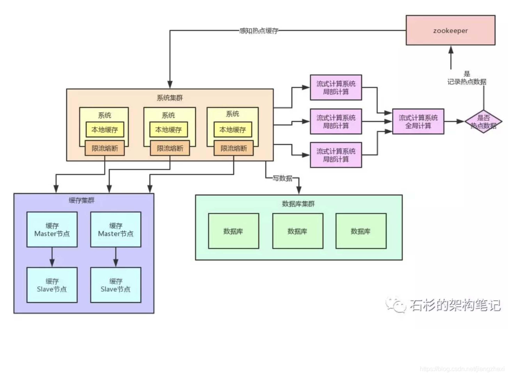

# 某个key出现了热点缓存导致集群中某个机器负载过高怎么办



## 1、找热点数据写入zk
```
然后一旦在实时数据访问次数统计的过程中，比如发现一秒之内，某条数据突然访问次数超过了1000，就直接立马把这条数据判定为是热点数据.
可以将这个发现出来的热点数据写入比如zookeeper中。
```

## 2、本地app监听zk写localCache
```
我们自己的系统可以对zookeeper指定的热点缓存对应的znode进行监听，如果有变化他立马就可以感知到了。
此时系统层就可以立马把相关的缓存数据从数据库加载出来，然后直接放在自己系统内部的本地缓存里即可。
```